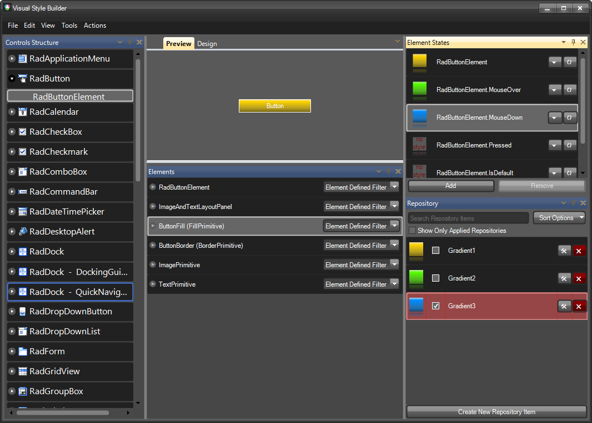

# Visual Style Builder

 Visual Style Builder is a stand alone application that allows you to create custom or edit the predefined themes. With Visual Style Builder you can:

* Set properties

* Inherit properties

* Animate changes

* Save themes 

* Edit the predefined themes. 

## Set Properties

Using Visual Style Builder you can alter, at design-time or run time, a predefined set of properties of a control. Because all Telerik controls are composed of primitives, this customization can be applied at a very fine level of detail. For example, if you are working with a RadMenu control you can easily change the background color used for submenu items without changing the color used for main menu items.

Run time changes to property values can be tied to the state of a control. For example, it is possible to have the font size used for the text on a tab change when the tab is selected, when the mouse passes over the tab, or when the user clicks on the tab (or in response to any combination of these events).

## Inherit Properties

When working with complex controls in Visual Style Builder, you can inherit property values (such as colors, or fonts) from parent elements to child elements, or override them at the child element level. Consider the Telerik RadRibbonBar control, which is composed of many individual elements including the tiny pieces that make up the tabs, groups, controls, menu items, and other parts of the user interface. If you want to change the overall color scheme for the Telerik RadRibbonBar, you can make a few property settings to the elements near the top of the [logical tree of elements]() and let those settings be inherited by all the child elements. On the other hand, if you want the individual tabs to stand out from your overall color scheme, you can override the main colors for the tabs only, while still allowing everything else to continue to inherit the basic colors.
        

| RELATED VIDEOS |  |
| ------ | ------ |
|[What's New in Visual Style Builder for R1 2010](http://tv.telerik.com/watch/winforms/visualstylebuilder/whats-new-visual-style-builder-q1-2010) In this video, you will learn about all of the incredible new features included with the R1 2010 version of Visual Style Builder. (Runtime: 15:13)||
|[Styling Basics with Visual Style Builder for WinForms](http://tv.telerik.com/watch/winforms/visualstylebuilder/styling-basics-with-visual-style-builder-winforms) In this video, you will learn how to create a basic theme using repositories in Visual Style Builder for WinForms. You will then learn how to use this theme in your Telerik UI for WinForms based applications. (Runtime: 09:12)||
|[Introduction to the Visual Style Builder for WinForms](http://tv.telerik.com/watch/winforms/visualstylebuilder/introduction-new-visual-style-builder-winforms) In this recorded webinar, you will learn how to build themes using the latest version of Visual Style Builder. You will also learn what Theme Repositories are and how they make creating themes easier. (Runtime: 42:56)||
|[Changing Themes at Run Time with Telerik UI for WinForms](http://tv.telerik.com/watch/winforms/visualstylebuilder/changing-themes-at-run-time-with-radcontrols-winforms) In this video, you will learn how to give your users the ability to choose between Telerik themes and custom themes at run time. (Runtime: 08:42)||
