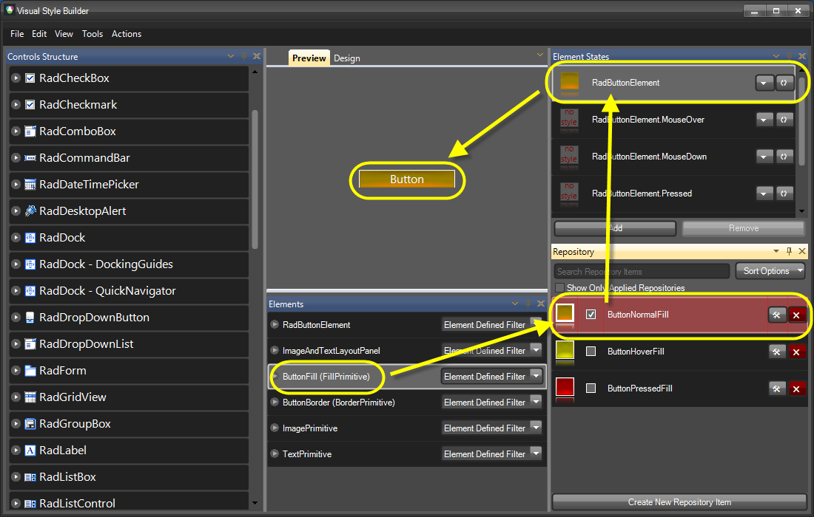
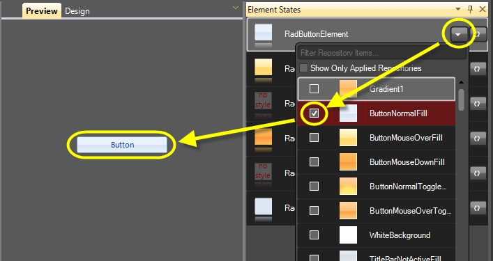
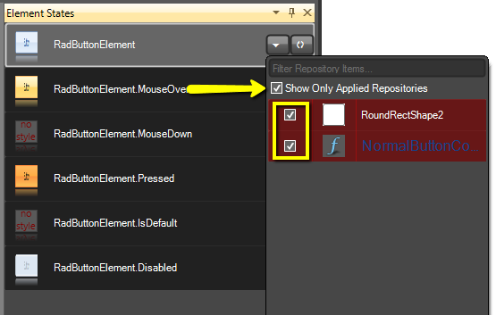

# Working With Repository Items

|RELATED VIDEOS| |
|----|----|
|[Introduction to the New Visual Style Builder for WinForms](http://tv.telerik.com/winforms/visualstylebuilder/introduction-new-visual-style-builder-winforms) In this recorded webinar, you will learn how to build themes using the latest version of Visual Style Builder. You will also learn what Theme Repositories are and how they make creating themes easier. (Runtime: 42:56)||

## Overview

Repository and Repository Items are major concept in Visual Style Builder. These items allow you to quickly apply property settings per element basis and since repository items' settings are reused, the size of the generated XML files and the time needed to de-serialize them are optimized. Visual Style Builder allows for intuitive and straightforward Repository management through series of editors and User Experience tools such as drag-and-drop to an ItemState, on-the-fly drop-down of all available Repository Items, etc.
        

## Repository Item Types

Each repository contains items that can be reused throughout themes. The  currently supported repository item types are as listed below:

* Fill

* Border

* Text

* Image

* Arrow

The different repository item types are mapped to different types of elements. For example, Fill repository items can be only associated with instances of the FillPrimitive class. Following the same logic, Border repository items are only applicable to BorderPrimitive elements and Arrow repository items to ArrowPrimitive instances. Image and Text repository items are a bit different in terms of supported elements. For instance, Text repository items can applied both to TextPrimitive and VisualElement instances. Image repository items can be applied both to ImagePrimitive instances and VisualElements that support images. In general, you should not have any concern when applying repository items since the Visual Style Builder automatically filters the available repository items according to the currently styled elements.
        

You can also create new repository items for the currently loaded repository. There are separate editors for each repository item type which are displayed accordingly. Before saving the newly created repository item, the Visual Style Builder checks whether its key is unique and if not, prompts you to change the key with a unique value.
        

## Repository Item Types and LightVisualElement

The LightVisualElement is a special type of primitive class that supports the functionality of all other primitives without building an element tree. In other words, the LightVisualElement paints its Fill, Border, Text and Image on its own. Therefore, the LightVisualElement is type of element that supports all Repository Item Types (excluding Arrow type) and thus, when editing such elements in the Visual Style Builder, the repository is filtered appropriately to display all repository items available.
        

>caution It is important to understand the difference between different primitives (Border, Fill, Arrow etc.) and the LightVisualElement type. LightVisualElement supports multiple types of repository items since it basically encapsulates the functionality of a border, fill, text and image primitive. Therefore, when you select an  element in the Elements list that is actually an instance of the  LightVisualElement class (used in RadGridView, RadScheduler and RadCalendar), you simply need to assign to it the different types of repositories in order to style it according to your requirements, i.e. you can associate a border repository item, fill and image simultaneously and its appearance will be properly adjusted (the cells of a grid, scheduler, or calendar).
This is not the case with elements made up of different primitives as border, fill and image. You will need to separately select and style each primitive from the Elements grid for the different states in this case (a good example is RadButtonElement and its children).
>

## Associating Repository Items with Elements and States

You can easily associate a repository item with a given element for a  specific state by dragging the repository item from the repository and dropping it onto the state in question:
        

The picture above shows how a repository item with name ButtonNormalFill is associated with the ButtonFill element of the RadButton control for the default (RadButtonElement) state.

 Another way to associate a repository item with an element for a given state is to use the state’s Available Repository Items popup which is shown upon click on the drop-down button on the right side of the state visual representation:

The Available Repository Items popup contains a list of repository items that can be associated with the selected state of the current element. Repository items that are associated to a Visual State are highlighted in red and are initially checked.

## Removing Repository Item Association

Depending on whether you want to remove all repository item associations or just a specific one, you can take two directions:

* Press the ‘Remove All Repository Item Associations’ button which is displayed on each state next to the drop-down button

* Open the ‘Available Repository Items’ popup, click the Show Only Applied Repositories check box to view only the associates with this state repositories and uncheck the repository items to remove the association with them:

## Editing Repository Items

You can easily edit a repository item by opening its editor from the ‘Edit Repository Item’ button for each repository item in the list as shown on the picture below:

The ‘Edit Repository Item ‘ dialog is automatically adjusted to show specific controls for the specific repository item types. In general, however,  the dialog provides you with possibility to define a key and a name for the repository item, as well as to define whether the repository item’s property settings are animated. You can also choose to modify the settings of the item and save a new repository item without overwriting the current one. On the right side of the dialog there is a property grid that displays all properties that can be modified for the repository item. The properties in bold have  values defined in the repository item while the others have their default values:

>caution The properties in bold have values defined in the repository item while the others have their default values.
>

>note When defining repository item key you should make sure that the key is unique in order to create/save the item.
>

The Animate State Transition checkbox determines whether the repository item’s property values will be animated when a state of the element, to which the item is associated, is activated. For instance,  all color properties of the repository item, displayed in the dialog above, will be animated from the values present when the corresponding element state occurs, to the values defined in the property grid on the right. After editing the repository item, you can either cancel the modifications by pressing the "Cancel" button, save the modifications by pressing the "OK" button, or save a new repository item by pressing the "Save As New" button. The "Save As New" button is only visible when an already existing repository item is opened for edit.
        

>caution When changing a  repository item’s key it is important to know that each property setting  group (a group of style settings within a StyleSheet) that uses this repository item should be updated to reference the new key. The Visual Style Builder allows for renaming a repository item’s key and updates the references of all property setting groups that are currently __ *loaded* __ . However, imagine that you create a couple of themes that use the same repository and save them. After that reopen them by selecting the repository and some of the files saved (not all). If you now rename a repository item’s key, the Visual Style Builder will update all references in the loaded StyleSheets but those left unloaded will still continue using old keys which will break the stylesheet.
>

## Deleting Repository Items

You can easily delete a repository item from the currently loaded repository  by clicking on the red "Delete" button which resides next to the "Edit" button. You will be asked to confirm the operation and in case you do so, the repository item will be removed from the repository.  All references to this repository item will be removed also.
