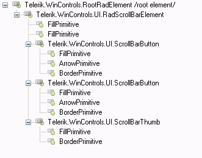

# Control Element Structure

## 

This image shows the __Control Element Structure__ of __RadScrollBar__ as displayed by __Visual Style Builder__:

As every control which is build with Telerik Presentation Framework, __RadVScrollBar__and __RadHScrollBar__consist of building elements order in a tree where property values are inherited in direction from the root to the leaves. The rest of the article discusses the most important nodes for the scrollbar controls.

__RadScrollBarElement__ (the second node in the hierarchy) is an abstraction node so that the __element__ can be used in other controls i.e. RadGridView. 

The __FillPrimitive__ sets the overall background properties that are inherited by the other elements. 

The __ScrollBarButton__ elements represent the arrows at both ends of the scroll bar. Each one consists of a __FillPrimitive,__ an __ArrowPrimitive__, and a __BorderPrimitive__. 

The __ScrollBarThumb__ element represents the scroll bar thumb. It consists of a __FillPrimitive__ and a __BorderPrimitive__. 
