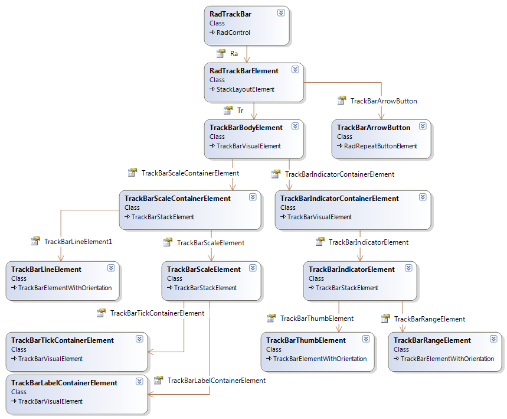

# Control Element Structure

## 

RadTrackbar is built up of several levels of nested elements. The image below shows its element tree.

Here is a brief explanation of the various elements in the tree:
        

* The __RadTrackBarElement__ represents the entire __RadTrackBar__ control. 
            It contains two instances of __RadTrackArrowButton__ that represent the handlers (buttons) and the 
              __TrackBarBodyElement__.
            

* __TrackBarBodyElement__ wraps and arranges __TrackBarScaleContainerElement__ and 
              __TrackBarIndicatorContainerElement__. 
            

* __TrackBarScaleContainerElement__ wraps and arranges __TrackBarScaleElement__ and
              __TrackBarLineElement__. 
            

* Each instance of __TrackBarScaleElement__ contains its own set of __TrackBarTickContainerElement__ 
              and __TrackBarLabelContainerElement__ that generates and arranges the ticks and labels respectively.
            

* __TrackBarIndicatorContainerElement__ generates and arranges the __TrackbarIndicatorElements__
              according the [mode]() of RadTrackBar and the content of the __Ranges__ 
              collection. This class creates a connection between the logical __TrackBarRange__ and its visual representation 
              - __TrackbarIndicatorElements__.
            

* __TrackbarIndicatorElements__ represent a set of __TrackBarThumbElement__
              and __TrackbarRangeElement__. This set represents two thumbs and a line between them.
            
