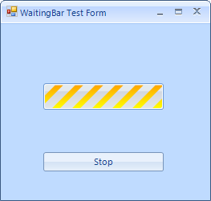
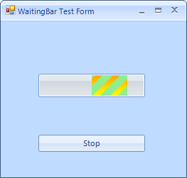

# Customizing RadWaitingBar


RadWaitingBar introduces rich API which allows you to easily customize  the visual appearance of RadWaitingBar programmatically. Below you will find scenarios that will increase your knowledge about RadWaitingBar's API, hence you will be able to customize it according to your requirements.      
      

## How to customize the text of RadWaitingBar

The text of RadWaitingBar is not displayed by default. To show the text, set the __ShowText__ property of RadWaitingBar to true.  To change the text content, use the __Text__ property of RadWaitingBar. To customize the text orientation, set the __AngleTransform__ property of the RadWaitingBarElement.TextElement. To modify the text position, change the __TextAlignment__ property of RadWaitingBarElement.TextElement. Here is a sample snippet:

{{source=..\SamplesCS\TrackAndStatus\WaitingBar\CustomizingRadWaitingBar.cs region=text}} 
{{source=..\SamplesVB\TrackAndStatus\WaitingBar\CustomizingRadWaitingBar.vb region=text}} 

````C#
this.radWaitingBar1.ShowText = true;
this.radWaitingBar1.Text = "Waiting...";
this.radWaitingBar1.WaitingBarElement.TextElement.AngleTransform = 180;
this.radWaitingBar1.WaitingBarElement.TextElement.TextAlignment = ContentAlignment.MiddleLeft;

````
````VB.NET
Me.RadWaitingBar1.ShowText = True
Me.RadWaitingBar1.Text = "Waiting..."
Me.RadWaitingBar1.WaitingBarElement.TextElement.AngleTransform = 180
Me.RadWaitingBar1.WaitingBarElement.TextElement.TextAlignment = ContentAlignment.MiddleLeft

````

{{endregion}} 


## How to customize RadWaitingBar’s Dash style 

To set the RadWaitingBar in dash style set the __WaitingStyle__ property to __Dash__.  To customize the appearance of the stripes-pattern, you need to access the RadWaitingBarElement.SeparatorElement. Here is a sample scenario:

{{source=..\SamplesCS\TrackAndStatus\WaitingBar\CustomizingRadWaitingBar.cs region=dash}} 
{{source=..\SamplesVB\TrackAndStatus\WaitingBar\CustomizingRadWaitingBar.vb region=dash}} 

````C#
this.radWaitingBar1.WaitingStyle = Telerik.WinControls.Enumerations.WaitingBarStyles.Dash;
WaitingBarSeparatorElement dash = this.radWaitingBar1.WaitingBarElement.SeparatorElement;
dash.NumberOfColors = 2;
dash.BackColor = Color.Orange;
dash.BackColor2 = Color.Yellow;
dash.SweepAngle = 45;
dash.StepWidth = 15;
dash.SeparatorWidth = 10;
dash.GradientPercentage = 0.25f;

````
````VB.NET
Me.RadWaitingBar1.WaitingStyle = Telerik.WinControls.Enumerations.WaitingBarStyles.Dash
Dim dash As WaitingBarSeparatorElement = Me.RadWaitingBar1.WaitingBarElement.SeparatorElement
dash.NumberOfColors = 2
dash.BackColor = Color.Orange
dash.BackColor2 = Color.Yellow
dash.SweepAngle = 45
dash.StepWidth = 15
dash.SeparatorWidth = 10
dash.GradientPercentage = 0.25F

````

{{endregion}} 



## How to set Dash style only for the waiting indicators

The waiting indicators also support dash style. To customize the appearance of the indicators’ stripes-pattern, you need to access the SeparatorElements of all indicators. By default, the Indicators collection contains two indicators. Here is a sample scenario:

{{source=..\SamplesCS\TrackAndStatus\WaitingBar\CustomizingRadWaitingBar.cs region=waitingIndicators}} 
{{source=..\SamplesVB\TrackAndStatus\WaitingBar\CustomizingRadWaitingBar.vb region=waitingIndicators}} 

````C#
this.radWaitingBar1.WaitingBarElement.WaitingIndicators[0].BackColor = Color.LightGreen;
this.radWaitingBar1.WaitingBarElement.WaitingIndicators[0].NumberOfColors = 1;
this.radWaitingBar1.WaitingBarElement.WaitingIndicators[1].BackColor = Color.LightGreen;
this.radWaitingBar1.WaitingBarElement.WaitingIndicators[1].NumberOfColors = 1;
WaitingBarSeparatorElement separator = ((WaitingBarIndicatorElement)this.radWaitingBar1.WaitingBarElement.WaitingIndicators[0]).SeparatorElement;
WaitingBarSeparatorElement helpSeparator = ((WaitingBarIndicatorElement)this.radWaitingBar1.WaitingBarElement.WaitingIndicators[1]).SeparatorElement;
separator.Dash = true;
helpSeparator.Dash = true;
separator.NumberOfColors = 2;
separator.BackColor = Color.Orange;
separator.BackColor2 = Color.Yellow;
separator.SweepAngle = 45;
separator.StepWidth = 15;
separator.SeparatorWidth = 10;
separator.GradientPercentage = 0.25f;
helpSeparator.NumberOfColors = 2;
helpSeparator.BackColor = Color.Orange;
helpSeparator.BackColor2 = Color.Yellow;
helpSeparator.SweepAngle = 45;
helpSeparator.StepWidth = 15;
helpSeparator.SeparatorWidth = 10;
helpSeparator.GradientPercentage = 0.25f;

````
````VB.NET
Me.RadWaitingBar1.WaitingBarElement.WaitingIndicators(0).BackColor = Color.LightGreen
Me.RadWaitingBar1.WaitingBarElement.WaitingIndicators(0).NumberOfColors = 1
Me.RadWaitingBar1.WaitingBarElement.WaitingIndicators(1).BackColor = Color.LightGreen
Me.RadWaitingBar1.WaitingBarElement.WaitingIndicators(1).NumberOfColors = 1
Dim separator As WaitingBarSeparatorElement = DirectCast(Me.RadWaitingBar1.WaitingBarElement.WaitingIndicators(0), WaitingBarIndicatorElement).SeparatorElement
Dim helpSeparator As WaitingBarSeparatorElement = DirectCast(Me.RadWaitingBar1.WaitingBarElement.WaitingIndicators(1), WaitingBarIndicatorElement).SeparatorElement
separator.Dash = True
helpSeparator.Dash = True
separator.NumberOfColors = 2
separator.BackColor = Color.Orange
separator.BackColor2 = Color.Yellow
separator.SweepAngle = 45
separator.StepWidth = 15
separator.SeparatorWidth = 10
separator.GradientPercentage = 0.25F
helpSeparator.NumberOfColors = 2
helpSeparator.BackColor = Color.Orange
helpSeparator.BackColor2 = Color.Yellow
helpSeparator.SweepAngle = 45
helpSeparator.StepWidth = 15
helpSeparator.SeparatorWidth = 10
helpSeparator.GradientPercentage = 0.25F

````

{{endregion}} 



## How to customize the shape of RadWatingBar

Different shapes can be applied to both the WaitingBarElement and the waiting indicator. In the following example the WaitingBarElement and the waiting indicator have elliptical shape:

{{source=..\SamplesCS\TrackAndStatus\WaitingBar\CustomizingRadWaitingBar.cs region=shape}} 
{{source=..\SamplesVB\TrackAndStatus\WaitingBar\CustomizingRadWaitingBar.vb region=shape}} 

````C#
Telerik.WinControls.EllipseShape shape = new Telerik.WinControls.EllipseShape();
this.radWaitingBar1.WaitingBarElement.Shape = shape;
this.radWaitingBar1.WaitingBarElement.ContentElement.Shape = shape;
this.radWaitingBar1.WaitingBarElement.WaitingIndicators[0].Shape = shape;
this.radWaitingBar1.WaitingBarElement.WaitingIndicators[1].Shape = shape;

````
````VB.NET
Dim shape As New Telerik.WinControls.EllipseShape()
Me.RadWaitingBar1.WaitingBarElement.Shape = shape
Me.RadWaitingBar1.WaitingBarElement.ContentElement.Shape = shape
Me.RadWaitingBar1.WaitingBarElement.WaitingIndicators(0).Shape = shape
Me.RadWaitingBar1.WaitingBarElement.WaitingIndicators(1).Shape = shape

````

{{endregion}} 


