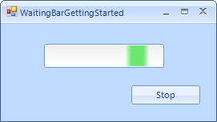

# Getting Started


## 

This tutorial illustrates how to start and stop the animation of RadWaitingBar.


1. 

Place a RadWaitingBar control and a RadButton control on a form.

1. 

Select the RadWaitingBar control.

1. 

In the Properties window set the WaitingDirection property to Bottom.

1. 

Resize the RadWaitingBar so that its height is larger than its width.

1. 

Select the RadButton control.

1. 

Set the Text property to Start.

1. 

In the Properties window click the events button.

1. 

Double-click the Click event.

1. 

Replace the automatically-generated event handler with this code:
     #_[C#]_

	


{{source=..\SamplesCS\TrackAndStatus\WaitingBar\WaitingGettingStarted.cs region=click}} 
{{source=..\SamplesVB\TrackAndStatus\WaitingBar\WaitingGettingStarted.vb region=click}} 

````C#
        private void radButton1_Click(object sender, EventArgs e)
        {
            if (radWaitingBar1.IsWaiting)
            {
                radWaitingBar1.StopWaiting();
                this.radButton1.Text = "Start";
            }
            else
            {
                radWaitingBar1.StartWaiting();
                this.radButton1.Text = "Stop";
            }
        }
````
````VB.NET
    Private Sub radButton1_Click(ByVal sender As Object, ByVal e As EventArgs)
        If RadWaitingBar1.IsWaiting Then
            RadWaitingBar1.StopWaiting()
            Me.RadButton1.Text = "Start"
        Else
            RadWaitingBar1.StartWaiting()
            Me.RadButton1.Text = "Stop"
        End If
    End Sub
    '
````

{{endregion}} 


1. 

Press __F5__ to run the project.

1. 

Click the Start button to start and stop the animation.


