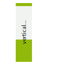
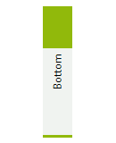

# Properties  

|Property|Description|Result|
|----|----|----|
|__Image__, __ImageKey__ and __ImageIndex__|Allows you manipulate the image displayed in the waiting indicators.||
|__IsWaiting__|Indicates whether the __RadWaitingBar__ is currently waiting.||
|__ShowText__|Indicates whether the text in __RadWaitingBar__ is displayed. By default, the text of __RadWaitingBar__ is not displayed. To show it, set the property to *true*. ||
|__StretchIndicatorsHorizontally__|Indicates whether the waiting indicators are stretched horizontally, so that their width equals the available width of the parent element.| |
| __StretchIndicatorsVertically__|Indicates whether the waiting indicators are stretched vertically, so that their height equals the available height of the parent element.| |
|__Orientation__|The property is set to *Horizontal* when the waiting indicator moves horizontally, i.e. the __WaitingDirection__ property is set to *Left* or *Right*. The property is set to *Vertical* when the waiting indicator moves vertically, i.e. the __WaitingDirection__ property is set to *Top* or *Bottom*.| |
|__WaitingDirection__|The property indicates the direction of indicators’ movement.  *Right*: the indicators move from left to right;  *Left*: the indicators move from right to left;  *Top*: the indicators move from bottom to top;  *Bottom*: the indicators move from top to bottom; Note that setting __WaitingDirection__ does not change the size of the control. This implies that when you set the property to *Bottom* or *Top*, you will need to resize the __RadWaitingBar__ appropriately, i.e. the control height should be larger than its width. Changing the __WaitingDirection__ property affects also the values of the __StretchIndicatorsVertically__ and the __StretchIndicatorsHorizontally__, unless a local value is assigned to either of the two properties. For example, when the __WaitingDirection__ is *Top* or *Bottom*, the __StretchIndicatorsVertically__ is set to *false* and the __StretchIndicatorsHorizontally__ is set to *true* automatically. When the __WaitingDirection__ is *Right* or *Left*, the __StretchIndicatorsVertically__ is set to *true* and the __StretchIndicatorsHorizontally__ is set to *false*.|  |
|__WaitingIndicatorSize__|The property allows you to set the size of the of the waiting indicators||
| __WaitingIndicatorWidth__|The property is obsolete. Currently, it sets the WaitingIndicatorSize.__Width__||
|__WaitingSpeed__|The property sets the speed of the animation. The higher the __WaitingSpeed__ is, the faster the waiting indicators move. __WaitingSpeed__ possible values range from *0* to *100*, where *1* sets the slowest indicator and *100* results in the fastest indicator. If the __WaitingSpeed__ is set to *0*,  the __WaitingStopped__ event is raised and the waiting process terminates. Then, if the __WaitingSpeed__ is set to a value greater than *0*, the __WaitingStarted__ event is raised and the waiting animation continues automatically.||
|__WaitingStep__|Sets the number of pixels the waiting indicators move during each step of the waiting animation process. If the __WaitingStep__ is set to *0*, the __WaitingStopped__ event is raised and the waiting process terminates. Then, if the __WaitingStep__ is set to a value greater than *0*, the __WaitingStarted__ event raises and the waiting animation continues automatically.||
|__WaitingStyle__|Sets the style of __RadWaitingBar__. Read more here: [Waiting Styles]()||

# Methods

|Method|Description|
|----|----|
|__StartWaiting__()|Starts the animation.|
|__StopWaiting__()|Stops the animation.|
|__ResetWaiting__()|Moves the waiting indicators to their initial position. Resetting the animation after the waiting process has been started will not stop the animation. Respectively, resetting the animation after the waiting process has been stopped will not start the animation.|
|__SetAssociatedControlRuntime__|Specifies the associated control.|

# Events

|Event|Description|
|----|----|
|__WaitingStarted__|Fires when the control starts waiting.|
|__WaitingStopped__|Fires when the control stops waiting.|
