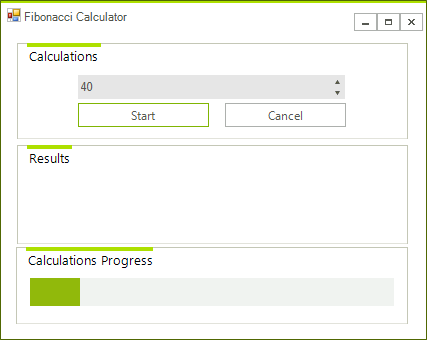
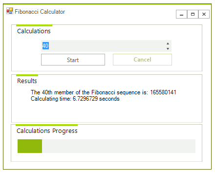

# Using WaitingBar with a Background Worker

RadWaitingBar is a useful control for indicating that a long-running operation is 
    undergoing. When using this control, however, many users face a similar issue:
    once the time-consuming operation is started, the control does not move its
    indicators and literally freezes. Such cases occur when the long-running operation 
    is executed on the same thread as the RadWaitingBar waiting process: the primary UI Thread. 
    The operation does not allow the form to update its UI and as a result the control does 
    not perform any waiting animation.

One obvious solution is to start the time-consuming operation in a new thread. 
    The following example illustrates how to achieve this through a BackgroundWorker.

## BackgroundWorker solution

The aim of the sample application is to calculate numbers of the Fibonacci sequence. In a straight-forward scenario, the user selects the position of the Fibonacci number through a RadSpinEditor and clicks the Start RadButton to trigger the time-consuming operation. While the calculations are undergoing the RadWaitingBar smoothly animates its waiting indicators and the RadForm remains responsive. Once the number is calculated, the result is displayed and the RadWaitingBar control is stopped.
			Below you will find snippets and comments which provide a detailed description of the sample application. Also, feel free to download the example project files appearing at the end of this tutorial. 
			
					 
    		 

1. 

When the form is loaded the BackgroundWorker instance should be initialized. Additionally, you should subscribe to two of its events: DoWork() and RunWorkerCompleted().

#### __[C#]__

{{region initialization}}
	        private void Form1_Load(object sender, EventArgs e)
	        {
	            myBackgroundWorker = new BackgroundWorker();
	            myBackgroundWorker.WorkerReportsProgress = true;
	            myBackgroundWorker.WorkerSupportsCancellation = true;
	            myBackgroundWorker.DoWork += new DoWorkEventHandler(myBackgroundWorker1_DoWork);
	            myBackgroundWorker.RunWorkerCompleted += new RunWorkerCompletedEventHandler(myBackgroundWorker1_RunWorkerCompleted);
	        }
	{{endregion}}

#### __[VB.NET]__

{{region initialization}}
	    Private Sub Form1_Load(ByVal sender As Object, ByVal e As EventArgs)
	        myBackgroundWorker = New BackgroundWorker()
	        myBackgroundWorker.WorkerReportsProgress = True
	        myBackgroundWorker.WorkerSupportsCancellation = True
	        AddHandler myBackgroundWorker.DoWork, AddressOf myBackgroundWorker1_DoWork
	        AddHandler myBackgroundWorker.RunWorkerCompleted, AddressOf myBackgroundWorker1_RunWorkerCompleted
	    End Sub
	    '#End Region
	
	    '#region workCompleted
	    Private Sub myBackgroundWorker1_RunWorkerCompleted(ByVal sender As Object, ByVal e As RunWorkerCompletedEventArgs)
	        Me.radWaitingBar1.StopWaiting()
	        Me.radWaitingBar1.ResetWaiting()
	        Me.radButton1.Enabled = True
	        Me.radButton2.Enabled = False
	        [end] = Date.Now
	
	        If (e.Cancelled = True) Then
	            Me.radLabel1.Text = "Calculations are canceled!"
	        ElseIf Not (e.Error Is Nothing) Then
	            Me.radLabel1.Text = ("Error: " & e.Error.Message)
	        Else
	            Me.radLabel1.Text = "The " & Me.radSpinEditor1.Value.ToString() & "th member of the Fibonacci sequence is: " & e.Result.ToString()
	            Dim span As New TimeSpan()
	            span = [end].Subtract(begin)
	
	            Me.radLabel1.Text += vbLf & "Calculating time: " & span.TotalSeconds & " seconds"
	        End If
	    End Sub
	{{endregion}}

1. 

When the user clicks the Start RadButton, you should run the BackgroundWorker through the RunWorkerAsync() method and, also, start the RadWaitingBar waiting process using the StartWaiting() method.

#### __[C#]__

{{region startingWorker}}
	        private void radButton1_Click(object sender, EventArgs e)
	        {
	            if (!myBackgroundWorker.IsBusy)
	            {
	                myBackgroundWorker.RunWorkerAsync(radSpinEditor1.Value);
	                this.radButton1.Enabled = false;
	                this.radButton2.Enabled = true;
	                this.radWaitingBar1.StartWaiting();
	                begin = DateTime.Now;
	                this.radLabel1.Text = "Calculations in process...";
	            }
	        }
	{{endregion}}

#### __[VB.NET]__

{{region startingWorker}}
	    Private Sub radButton1_Click(ByVal sender As Object, ByVal e As EventArgs)
	        If Not myBackgroundWorker.IsBusy Then
	            myBackgroundWorker.RunWorkerAsync(radSpinEditor1.Value)
	            Me.radButton1.Enabled = False
	            Me.radButton2.Enabled = True
	            Me.radWaitingBar1.StartWaiting()
	            begin = Date.Now
	            Me.radLabel1.Text = "Calculations in process..."
	        End If
	    End Sub
	{{endregion}}

1. 

In the DoWork event handler you should execute the time-consuming operation, i.e. calculate the required Fibonacci number.

#### __[C#]__

{{region working}}
	        void myBackgroundWorker1_DoWork(object sender, DoWorkEventArgs e)
	        {
	            BackgroundWorker worker = sender as BackgroundWorker;
	            int n = Convert.ToInt32(e.Argument);
	            e.Result = PerformComplexComputations(n, worker, e);
	        }
	
	        private long PerformComplexComputations(int n, BackgroundWorker worker, DoWorkEventArgs e)
	        {
	            long result = 0;
	
	            if (worker.CancellationPending)
	            {
	                e.Cancel = true;
	            }
	            else
	            {
	                if (n < 2) return 1;
	                result = PerformComplexComputations(n - 1, worker, e) + PerformComplexComputations(n - 2, worker, e);
	            }
	
	            return result;
	        }
	{{endregion}}

#### __[VB.NET]__

{{region working}}
	    Private Sub myBackgroundWorker1_DoWork(ByVal sender As Object, ByVal e As DoWorkEventArgs)
	        Dim worker As BackgroundWorker = TryCast(sender, BackgroundWorker)
	        Dim n As Integer = Convert.ToInt32(e.Argument)
	        e.Result = PerformComplexComputations(n, worker, e)
	    End Sub
	
	    Private Function PerformComplexComputations(ByVal n As Integer, ByVal worker As BackgroundWorker, ByVal e As DoWorkEventArgs) As Long
	        Dim result As Long = 0
	
	        If worker.CancellationPending Then
	            e.Cancel = True
	        Else
	            If n < 2 Then
	                Return 1
	            End If
	            result = PerformComplexComputations(n - 1, worker, e) + PerformComplexComputations(n - 2, worker, e)
	        End If
	
	        Return result
	    End Function
	{{endregion}}

1. 

When the long-running operation has completed, you should stop the RadWaitingBar control waiting process through the StopWaiting() method. Additionally, you should display the result to the user.

#### __[C#]__

{{region workCompleted}}
	        void myBackgroundWorker1_RunWorkerCompleted(object sender, RunWorkerCompletedEventArgs e)
	        {
	            this.radWaitingBar1.StopWaiting();
	            this.radWaitingBar1.ResetWaiting();
	            this.radButton1.Enabled = true;
	            this.radButton2.Enabled = false;
	            end = DateTime.Now;
	
	            if ((e.Cancelled == true))
	            {
	                this.radLabel1.Text = "Calculations are canceled!";
	            }
	            else if (!(e.Error == null))
	            {
	                this.radLabel1.Text = ("Error: " + e.Error.Message);
	            }
	            else
	            {
	                this.radLabel1.Text = "The " + this.radSpinEditor1.Value.ToString() + "th member of the Fibonacci sequence is: " + e.Result.ToString();
	                TimeSpan span = new TimeSpan();
	                span = end - begin;
	
	                this.radLabel1.Text += "\nCalculating time: " + span.TotalSeconds + " seconds";
	            }
	        }
	{{endregion}}

#### __[VB.NET]__

{{region workCompleted}}
	    Private Sub myBackgroundWorker1_RunWorkerCompleted(ByVal sender As Object, ByVal e As RunWorkerCompletedEventArgs)
	        Me.radWaitingBar1.StopWaiting()
	        Me.radWaitingBar1.ResetWaiting()
	        Me.radButton1.Enabled = True
	        Me.radButton2.Enabled = False
	        [end] = Date.Now
	
	        If (e.Cancelled = True) Then
	            Me.radLabel1.Text = "Calculations are canceled!"
	        ElseIf Not (e.Error Is Nothing) Then
	            Me.radLabel1.Text = ("Error: " & e.Error.Message)
	        Else
	            Me.radLabel1.Text = "The " & Me.radSpinEditor1.Value.ToString() & "th member of the Fibonacci sequence is: " & e.Result.ToString()
	            Dim span As New TimeSpan()
	            span = [end].Subtract(begin)
	
	            Me.radLabel1.Text += vbLf & "Calculating time: " & span.TotalSeconds & " seconds"
	        End If
	    End Sub
	{{endregion}}

