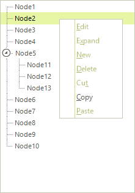
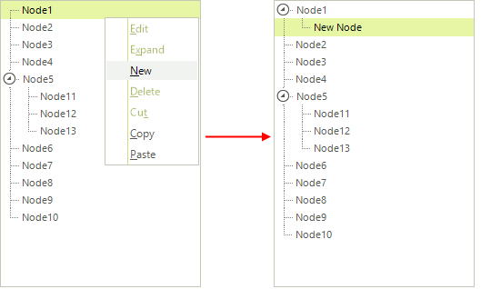
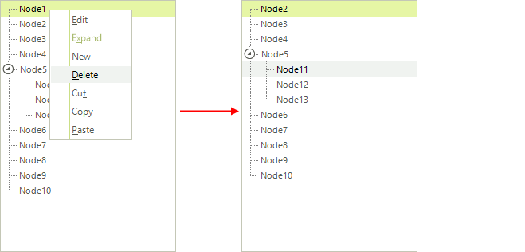

# Default Context Menu


RadTreeView displays a default context menu which appears when you right-click on a node. This menu contains 7 items and they are:
      

* __New__: A new sibling node is created.
          

* __Edit__: An editor appears at the position of the node from which the context menu is invoked. This editor allows you to change a property of the node.
          

* __Delete__: The node from which the menu is invoked is deleted.
          

* __Expand__/__Collapse__: Depending on the expaded state of the node, this menu item may display itself as "Expand" or "Collapse". When click the corresponding operations occurs.
          

* __Cut__: The node from which the context menu is invoked together with its child nodes (in short - the whole branch) is cut.
          

* __Copy__: The node from which the context menu is invoked together with its child nodes (in short - the whole branch) is copied.
          

* __Paste__: If there a cut or copied node (branch), this node is added as a sibling node to the node from which the context menu is invoked.
          

## Enabling the default context menu items

__Enabling the default context menu__

The default context menu is not enabled by default and if you right-click a node, it will not appear on the screen. In order to enable it, you should set the __AllowDefaultContextMenu__ property to *true*:

{{source=..\SamplesCS\TreeView\ContextMenus\TreeViewMenus.cs region=defaultMenu}} 
{{source=..\SamplesVB\TreeView\ContextMenus\TreeViewMenus.vb region=defaultMenu}} 

````C#
this.radTreeView1.AllowDefaultContextMenu = true;

````
````VB.NET
Me.RadTreeView1.AllowDefaultContextMenu = True

````

{{endregion}} 




This will display only a small subset of all available menu items. Please note that only the *Expand/Collapse* item is enabled. All the other items are disabled and below you will see how to enable them.

__Enabling the New item__

To enable the New item, you should set the __AllowAdd__ property to *true*:

{{source=..\SamplesCS\TreeView\ContextMenus\TreeViewMenus.cs region=allowAdd}} 
{{source=..\SamplesVB\TreeView\ContextMenus\TreeViewMenus.vb region=allowAdd}} 

````C#
this.radTreeView1.AllowAdd = true;

````
````VB.NET
Me.RadTreeView1.AllowAdd = True

````

{{endregion}} 




__Enabling the Edit item__: To enable the Edit item, you should set the __AllowEdit__ property to *true*:

{{source=..\SamplesCS\TreeView\ContextMenus\TreeViewMenus.cs region=allowEdit}} 
{{source=..\SamplesVB\TreeView\ContextMenus\TreeViewMenus.vb region=allowEdit}} 

````C#
this.radTreeView1.AllowEdit = true;

````
````VB.NET
Me.RadTreeView1.AllowEdit = True

````

{{endregion}} 


__Enabling the Delete item__: To enable the Delete item, you should set the __AllowRemove__ property to *true*:

{{source=..\SamplesCS\TreeView\ContextMenus\TreeViewMenus.cs region=allowRemove}} 
{{source=..\SamplesVB\TreeView\ContextMenus\TreeViewMenus.vb region=allowRemove}} 

````C#
this.radTreeView1.AllowRemove = true;

````
````VB.NET
Me.RadTreeView1.AllowRemove = True

````

{{endregion}} 


