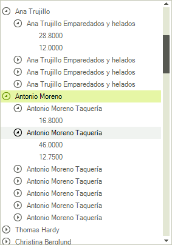
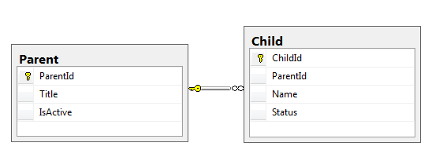
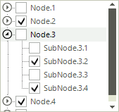

# Binding to Object-relational Data


## Binding RadTreeView to related data - custom objects

RadTreeView has the ability to bind to related data of custom objects which have member collections of related objects (ORM generated classes for example).
        

Consider the following class diagram: 


There are three classes named __Customer__, __Order__ and __Order_Detail__. The __Customer__ class represents a custom.
        

The data relations in the case of custom objects are represented by properties which provide references to collections of related objects. In this case the __Customer__ class has a property named __Orders__ which is a collection of __Order__ objects. This is the first relation. The second relation is the __Order_Details__ property in the __Order__ class, it offers a reference to a collection of __Order_Details__. Once you have such class composition, it is trivial for RadTreeView to represent it visually in your application.
        

The two steps that must be done are these:

1\. Set the DataSource of RadTreeView to a collection of your root objects (a collection of Customer object in this case):

{{source=..\SamplesCS\TreeView\DataBinding\BindingToRelatedData.cs region=customers}} 
{{source=..\SamplesVB\TreeView\DataBinding\BindingToRelatedData.vb region=customers}} 

````C#
            
IEnumerable<Customer> customers = context.GetTable<Customer>().ToList();       
this.radTreeView1.DataSource = customers;

````
````VB.NET
Dim customers As IEnumerable(Of Customer) = context.GetTable(Of Customer)().ToList()
Me.RadTreeView1.DataSource = customers

````

{{endregion}} 

2\. Set DisplayMember corresponding to the DisplayMembers of the different types of objects and set the ChildMember corresponding to the names of the properties that represent the collections of sub objects.

{{source=..\SamplesCS\TreeView\DataBinding\BindingToRelatedData.cs region=relationClasses}} 
{{source=..\SamplesVB\TreeView\DataBinding\BindingToRelatedData.vb region=relationClasses}} 

````C#
            
this.radTreeView1.DisplayMember = "ContactName\\ShipName\\UnitPrice";
this.radTreeView1.ChildMember = "Customers\\Orders\\Order_Details";

````
````VB.NET
Me.RadTreeView1.DisplayMember = "ContactName\ShipName\UnitPrice"
Me.RadTreeView1.ChildMember = "Customers\Orders\Order_Details"

````

{{endregion}} 

As a result, we get the following hierarchy in RadTreeView:



## Binding check boxes

Since Q3 2014 __RadTreeView__ supports binding the check-boxes of the nodes to a field in the data. You just need to specify the RadTreeView. __CheckedMember__ property in addition to the necessary information described above. 

Consider the following diagram which can be illustrated with the sample classes below: 

Note that the *IsActive* and the *Status* properties represent boolean data. 

{{source=..\SamplesCS\TreeView\DataBinding\BindingToRelatedData.cs region=DataClasses}} 
{{source=..\SamplesVB\TreeView\DataBinding\BindingToRelatedData.vb region=DataClasses}} 

````C#
    
public class Parent 
{
    public string ParentId { get; set; }
    
    public string Title { get; set; }
    
    public bool IsActive { get; set; }
    
    public List<Child> Children { get; set; }
        
    public Parent(string parentId, string title, bool isActive, List<Child> children)
    {
        this.ParentId = parentId;
        this.Title = title;
        this.IsActive = isActive;
        this.Children = children;
    }
}
    
public class Child
{
    public string ChildId { get; set; }
    
    public string ParentId { get; set; }
    
    public string Name { get; set; }
    
    public bool Status { get; set; }
        
    public Child(string childId, string parentId, string name, bool status)
    {
        this.ChildId = childId;
        this.ParentId = parentId;
        this.Name = name;
        this.Status = status;
    }
}

````
````VB.NET
Public Class Parent
    Public Property ParentId() As String
        Get
            Return m_ParentId
        End Get
        Set(value As String)
            m_ParentId = value
        End Set
    End Property
    Private m_ParentId As String
    Public Property Title() As String
        Get
            Return m_Title
        End Get
        Set(value As String)
            m_Title = value
        End Set
    End Property
    Private m_Title As String
    Public Property IsActive() As Boolean
        Get
            Return m_IsActive
        End Get
        Set(value As Boolean)
            m_IsActive = value
        End Set
    End Property
    Private m_IsActive As Boolean
    Public Property Children() As List(Of Child)
        Get
            Return m_Children
        End Get
        Set(value As List(Of Child))
            m_Children = value
        End Set
    End Property
    Private m_Children As List(Of Child)
    Public Sub New(parentId As String, title As String, isActive As Boolean, children As List(Of Child))
        Me.ParentId = parentId
        Me.Title = title
        Me.IsActive = isActive
        Me.Children = children
    End Sub
End Class
Public Class Child
    Public Property ChildId() As String
        Get
            Return m_ChildId
        End Get
        Set(value As String)
            m_ChildId = value
        End Set
    End Property
    Private m_ChildId As String
    Public Property ParentId() As String
        Get
            Return m_ParentId
        End Get
        Set(value As String)
            m_ParentId = value
        End Set
    End Property
    Private m_ParentId As String
    Public Property Name() As String
        Get
            Return m_Name
        End Get
        Set(value As String)
            m_Name = value
        End Set
    End Property
    Private m_Name As String
    Public Property Status() As Boolean
        Get
            Return m_Status
        End Get
        Set(value As Boolean)
            m_Status = value
        End Set
    End Property
    Private m_Status As Boolean
    Public Sub New(childId As String, parentId As String, name As String, status As Boolean)
        Me.ChildId = childId
        Me.ParentId = parentId
        Me.Name = name
        Me.Status = status
    End Sub
End Class

````

{{endregion}} 

The code snippet below illustrates how to bind the check-boxes coming from the described properties:



{{source=..\SamplesCS\TreeView\DataBinding\BindingToRelatedData.cs region=CheckedMember}} 
{{source=..\SamplesVB\TreeView\DataBinding\BindingToRelatedData.vb region=CheckedMember}} 

````C#
            
List<Parent> dataItems = new List<Parent>();
Parent currentParent;
Child currentChild;
List<Child> children;
string parentId = string.Empty;
string childId = string.Empty;
for (int i = 1; i <= 5; i++)
{
    parentId = Guid.NewGuid().ToString();
        
    children = new List<Child>();
    for (int j = 1; j < 5; j++)
    {
        childId = Guid.NewGuid().ToString();
        currentChild = new Child(childId, parentId, "SubNode." + i + "." + j, j % 2 == 0);
        children.Add(currentChild);
    }
    currentParent = new Parent(parentId, "Node." + i, i % 2 == 0,children);
    dataItems.Add(currentParent);
}
            
radTreeView1.DataSource = dataItems;
radTreeView1.DisplayMember = "Title\\Name";
radTreeView1.ChildMember = "Parent\\Children";
radTreeView1.CheckedMember = "IsActive\\Status";
radTreeView1.CheckBoxes = true;

````
````VB.NET
Dim dataItems As New List(Of Parent)()
Dim currentParent As Parent
Dim currentChild As Child
Dim children As List(Of Child)
Dim parentId As String = String.Empty
Dim childId As String = String.Empty
For i As Integer = 1 To 5
    parentId = Guid.NewGuid().ToString()
    children = New List(Of Child)()
    For j As Integer = 1 To 4
        childId = Guid.NewGuid().ToString()
        currentChild = New Child(childId, parentId, "SubNode." & i & "." & j, j Mod 2 = 0)
        children.Add(currentChild)
    Next
    currentParent = New Parent(parentId, "Node." & i, i Mod 2 = 0, children)
    dataItems.Add(currentParent)
Next
radTreeView1.DataSource = dataItems
radTreeView1.DisplayMember = "Title\Name"
radTreeView1.ChildMember = "Parent\Children"
radTreeView1.CheckedMember = "IsActive\Status"
radTreeView1.CheckBoxes = True

````

{{endregion}}
