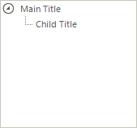

# Binding to XML Data


## 

RadTreeView can consume XML data both by directly loading it
          ([
            see Serialize/Deserialize to XML
          ]()) or by loading it to a __DataSet__for binding. 
          The following example uses a sample "Table of contents" XML.
          Each node element in the table of contents has a "Title" element, "id" and "parentid".
        

````xml
	<Toc>
	  <Node>
	    <Title>Main Title</Title>
	    <id>1</id>
	    <parentId></parentId>
	  </Node>
	  <Node>
	    <Title>Child Title</Title>
	    <id>2</id>
	    <parentId>1</parentId>
	  </Node>
	</Toc>
````


Assuming that "toc.xml" is in the TreeView\DataBinding directory which is relative to the directory of the
          the executable,
          the following code can be run from the form __Load__event handler.
          A new __DataSet__ object is created and the __DataSet____.ReadXml()__ method consumes the sample data. The element being shown is the
          __DisplayMember__property "Title". The ValueMember property
          is set to the "id" element and it will be available in the Value property of each RadTreeNode at runtime.
          The ParentMember and ChildMember properties define the relation between the records in the data source object:
        #_[C#]_

	

#_[VB.NET]_

	


