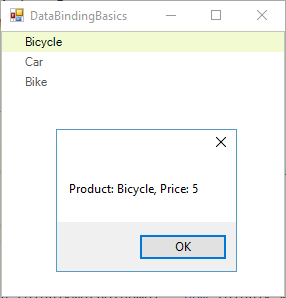
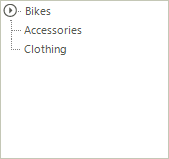

# Data Binding Basics


RadTreeView binds to any object that implements IList, IListSource or IBindingList. This includes generic lists and BindingSource for example. To make databinding work, you must assign the __DataSource__ property of the treeview. 
      

Set the __DisplayMember__ to the name of the field that you want visible in the treeview and the __ValueMember__ to the name of a field that is stored in each node's __Value__ property.
      

## 

The example below binds a generic list of "Product" objects and displays only a single level of data. "Product" has an integer field, a float field and a string field. In this example, we set the ValueMember to the int field and the DisplayMember to the string field:


{{source=..\SamplesCS\TreeView\DataBinding\Product.cs region=product}} 
{{source=..\SamplesVB\TreeView\DataBinding\Product.vb region=product}} 
````C#
public class Product
{
    private int _id;
    private string _description;
    private float _price;

    public int ID
    {
        get { return _id; }
        set { _id = value; }
    }

    public string Description
    {
        get { return _description; }
        set { _description = value; }
    }

    public float Price
    {
        get { return _price; }
        set { _price = value; }
    }

    public Product(int id, string description, float price)
    {
        _id = id;
        _description = description;
        _price = price;
    }
}

````
````VB.NET
public class Product
{
    private int _id;
    private string _description;
    private float _price;
    public int ID
    {
        get { return _id; }
        set { _id = value; }
    }
    public string Description
    {
        get { return _description; }
        set { _description = value; }
    }
    public float Price
    {
        get { return _price; }
        set { _price = value; }
    }
    public Product(int id, string description, float price)
    {
        _id = id;
        _description = description;
        _price = price;
    }
}

````

{{endregion}} 

{{source=..\SamplesCS\TreeView\DataBinding\DataBindingBasics.cs region=dataBindingBasics}} 
{{source=..\SamplesVB\TreeView\DataBinding\DataBindingBasics.vb region=dataBindingBasics}} 

````C#
public partial class DataBindingBasics : Form
{
    public DataBindingBasics()
    {
        InitializeComponent();
        List<Product> products = new List<Product>();
        products.Add(new Product(567, "Bicycle", 5));
        products.Add(new Product(456, "Car", 5000));
        products.Add(new Product(789, "Bike", 1500));
        radTreeView1.DataSource = products;
        radTreeView1.DisplayMember = "Description";
        radTreeView1.ValueMember = "ID";
        radTreeView1.SelectedNodeChanged += radTreeView1_SelectedNodeChanged;
        radTreeView1.NodeDataBound += radTreeView1_NodeDataBound;
    }

````
````VB.NET
 Public Class DataBindingBasics
        Public Sub New()
            InitializeComponent()

            Dim products As New List(Of Product)()
            products.Add(New Product(567, "Bicycle", 5))
            products.Add(New Product(456, "Car", 5000))
            products.Add(New Product(789, "Bike", 1500))
            RadTreeView1.DisplayMember = "ID"
            RadTreeView1.DataSource = products
        End Sub

````

{{endregion}} 

## Getting the data bound object

To extend the previous example, let's get the price of a product when we select the node of that product. Obviously, RadTreeNode contains information only about the ID and the Description of a Product. So, in order to be able to retrieve the Price value, we need to get the DataBoundItem of the RadTreeNode as shown below:

{{source=..\SamplesCS\TreeView\DataBinding\DataBindingBasics.cs region=dataBoundItem}} 
{{source=..\SamplesVB\TreeView\DataBinding\DataBindingBasics.vb region=dataBoundItem}} 

````C#
void radTreeView1_SelectedNodeChanged(object sender, Telerik.WinControls.UI.RadTreeViewEventArgs e)
{
    Product product = e.Node.DataBoundItem as Product;
    if (product != null)
    {
        MessageBox.Show("Product: " + e.Node.Text + ", Price: " + product.Price);
    }
}

````
````VB.NET
Private Sub RadTreeView1_SelectedNodeChanged(ByVal sender As Object, ByVal e As Telerik.WinControls.UI.RadTreeViewEventArgs) Handles RadTreeView1.SelectedNodeChanged
    Dim product As Product = TryCast(e.Node.DataBoundItem, Product)
    If product IsNot Nothing Then
        MessageBox.Show("Product: " & e.Node.Text & ", Price: " & product.Price)
    End If
End Sub

````

{{endregion}} 

As a result, when we select a node, we will get a message box showing the price of the product related to the currently selected node:



When a __RadTreeNode__ is assigned with a data-bound item for the first time, the __NodeDataBound__ event is fired. This event can be useful in situations where you  need to sync properties of RadTreeNode with properties of the data bound item.

{{source=..\SamplesCS\TreeView\DataBinding\DataBindingBasics.cs region=nodeDataBoundEvent}} 
{{source=..\SamplesVB\TreeView\DataBinding\DataBindingBasics.vb region=nodeDataBoundEvent}} 

````C#
void radTreeView1_NodeDataBound(object sender, Telerik.WinControls.UI.RadTreeViewEventArgs e)
{
    DataRowView dataRow = e.Node.DataBoundItem as DataRowView;
    if(dataRow != null)
    {
        e.Node.ForeColor = (Color)dataRow["ForeColor"];
    }
}

````
````VB.NET
Private Sub RadTreeView1_NodeDataBound(sender As Object, e As Telerik.WinControls.UI.RadTreeViewEventArgs) Handles RadTreeView1.NodeDataBound
    Dim dataRow As DataRowView = TryCast(e.Node.DataBoundItem, DataRowView)
    If dataRow IsNot Nothing Then
        e.Node.ForeColor = DirectCast(dataRow("ForeColor"), Color)
    End If
End Sub
ion

````

{{endregion}} 

## Binding and Displaying Hierarchical data

The great value of RadTreeView is the ability to display hierarchical data. It supports binding to and displaying Database hierarchy and hierarchy of custom objects which have member collections of related objects (ORM generated classes for example).
        

The next example extends the previous examples to include a new "Category" parent level where each category contains multiple products. "Categories" has a single "Name" property and a list of products.



In order to display the hierarchy of business objects, we just need to set appropriate DisplayMember and ChildMember values. The DisplayMember value is built from the display members of the respective objects joined with the '\\' symbol ('\' for VB.NET). The ChildMember is built from the names of the properties that represent the collections of sub objects. Just like in the case of the DisplayMember, the names of these properties are joined with the '\\' symbol ('\' for VB.NET). The first member of the ChildMember string should represent the parent level of hierarchy and you can set it to a value of your choice. For example, in our case we set this member to "Categories", but we could also set it to "MyCategories":


{{source=..\SamplesCS\TreeView\DataBinding\BasicsHierarchyForm.cs region=hierarchy}} 
{{source=..\SamplesVB\TreeView\DataBinding\BasicsHierarchyForm.vb region=hierarchy}} 

````C#
        
public BasicsHierarchyForm()
{
    InitializeComponent();
    
    List<Product> products = new List<Product>();
    products.Add(new Product(567, "Bicycle", 5));
    products.Add(new Product(456, "Car", 5000));
    products.Add(new Product(789, "Bike", 1500));
    List<Category> categories = new List<Category>();
    categories.Add(new Category("Bikes", products));
    categories.Add(new Category("Accessories", null));
    categories.Add(new Category("Clothing", null));
    radTreeView1.DataSource = categories;
    radTreeView1.DisplayMember = "Name\\Description";
    radTreeView1.ChildMember = "Categories\\Products";
}
        
void radTreeView1_SelectedNodeChanged(object sender, Telerik.WinControls.UI.RadTreeViewEventArgs e)
{
    Product product = e.Node.DataBoundItem as Product;
    if (product != null)
    {
        MessageBox.Show("Product: " + e.Node.Text + ", Price: " + product.Price);
    }
}

````
````VB.NET
Public Sub New()
            InitializeComponent()

            Dim products As New List(Of Product)()
            products.Add(New Product(567, "Bicycle", 5))
            products.Add(New Product(456, "Car", 5000))
            products.Add(New Product(789, "Bike", 1500))
            Dim categories As New List(Of Category)()
            categories.Add(New Category("Bikes", products))
            categories.Add(New Category("Accessories", Nothing))
            categories.Add(New Category("Clothing", Nothing))
            RadTreeView1.DataSource = categories
            RadTreeView1.DisplayMember = "Name\Description"
            RadTreeView1.ChildMember = "Categories\Products"
        End Sub

        Private Sub RadTreeView1_SelectedNodeChanged(ByVal sender As Object, ByVal e As Telerik.WinControls.UI.RadTreeViewEventArgs)
            Dim product As Product = TryCast(e.Node.DataBoundItem, Product)
            If product IsNot Nothing Then
                MessageBox.Show("Product: " & e.Node.Text & ", Price: " & product.Price)
            End If
        End Sub

````

{{endregion}} 

{{source=..\SamplesCS\TreeView\DataBinding\Product.cs region=product}} 
{{source=..\SamplesVB\TreeView\DataBinding\Product.vb region=product}} 

````C#
        
public class Product
    {
        private int _id;
        private string _description;
        private float _price;

        public int ID
        {
            get { return _id; }
            set { _id = value; }
        }

        public string Description
        {
            get { return _description; }
            set { _description = value; }
        }

        public float Price
        {
            get { return _price; }
            set { _price = value; }
        }

        public Product(int id, string description, float price)
        {
            _id = id;
            _description = description;
            _price = price;
        }
    }

````
````VB.NET
public class Product
{
    private int _id;
    private string _description;
    private float _price;
    public int ID
    {
        get { return _id; }
        set { _id = value; }
    }
    public string Description
    {
        get { return _description; }
        set { _description = value; }
    }
    public float Price
    {
        get { return _price; }
        set { _price = value; }
    }
    public Product(int id, string description, float price)
    {
        _id = id;
        _description = description;
        _price = price;
    }
}

````

{{source=..\SamplesCS\TreeView\DataBinding\Category.cs region=category}} 
{{source=..\SamplesVB\TreeView\DataBinding\Category.vb region=category}} 

````C#
        
 public class Category
    {
        public Category(string name, List<Product> products)
        {
            _name = name;
            _products = products;
        }
        private List<Product> _products;
        private string _name;
        public string Name
        {
            get { return _name; }
            set { _name = value; }
        }
        public List<Product> Products
        {
            get { return _products; }
            set { _products = value; }
        }
    }

````
````VB.NET
Public Class Category
        Public Sub New(ByVal name As String, ByVal products As List(Of Product))
            _name = name
            _products = products
        End Sub
        Private _products As List(Of Product)
        Private _name As String
        Public Property Name() As String
            Get
                Return _name
            End Get
            Set(ByVal value As String)
                _name = value
            End Set
        End Property
        Public Property Products() As List(Of Product)
            Get
                Return _products
            End Get
            Set(ByVal value As List(Of Product))
                _products = value
            End Set
        End Property
    End Class

````

{{endregion}} 

## Binding check boxes

Since Q3 2014 __RadTreeView__ supports binding the check-boxes of the nodes to a field in the data. You just need to specify   the RadTreeView. __CheckedMember__ property. The following code snippet demonstrates how to setup hierarchical tree by using two separate DataTables:


{{source=..\SamplesCS\TreeView\DataBinding\BasicsHierarchyForm.cs region=CheckedMember}} 
{{source=..\SamplesVB\TreeView\DataBinding\BasicsHierarchyForm.vb region=CheckedMember}} 

````C#
 DataTable parentDt = new DataTable("Parent");
            parentDt.Columns.Add("MasterId", typeof(string));
            parentDt.Columns.Add("Title", typeof(string));
            parentDt.Columns.Add("IsActive", typeof(bool));
            
            DataTable childDt = new DataTable("Child");
            childDt.Columns.Add("ChildId", typeof(string));
            childDt.Columns.Add("ParentId", typeof(string));
            childDt.Columns.Add("Name", typeof(string));
            childDt.Columns.Add("Status", typeof(bool));
            
            string parentId = string.Empty;
            string childId = string.Empty;
            for (int i = 1; i <= 5; i++)
            {
                parentId = Guid.NewGuid().ToString();
                parentDt.Rows.Add(parentId, "Node." + i, i % 2 == 0);
                
                for (int j = 1; j < 5; j++)
                {
                    childId = Guid.NewGuid().ToString();
                    childDt.Rows.Add(childId, parentId, "SubNode." + i + "." + j, j % 2 == 0);
                }
            }
            
            radTreeView1.DataSource = parentDt;
            radTreeView1.RelationBindings.Add(new RelationBinding(childDt,null,"Name","MasterId","ParentId","ChildId","Status"));
            radTreeView1.DisplayMember = "Title";
            radTreeView1.ValueMember = "Id";
            radTreeView1.CheckedMember = "IsActive";
            radTreeView1.CheckBoxes = true; 

````
````VB.NET
Dim parentDt As New DataTable("Parent")
            parentDt.Columns.Add("MasterId", GetType(String))
            parentDt.Columns.Add("Title", GetType(String))
            parentDt.Columns.Add("IsActive", GetType(Boolean))

            Dim childDt As New DataTable("Child")
            childDt.Columns.Add("ChildId", GetType(String))
            childDt.Columns.Add("ParentId", GetType(String))
            childDt.Columns.Add("Name", GetType(String))
            childDt.Columns.Add("Status", GetType(Boolean))

            Dim parentId As String = String.Empty
            Dim childId As String = String.Empty
            For i As Integer = 1 To 5
                parentId = Guid.NewGuid().ToString()
                parentDt.Rows.Add(parentId, "Node." & i, i Mod 2 = 0)

                For j As Integer = 1 To 4
                    childId = Guid.NewGuid().ToString()
                    childDt.Rows.Add(childId, parentId, "SubNode." & i & "." & j, j Mod 2 = 0)
                Next
            Next

            radTreeView1.DataSource = parentDt
            radTreeView1.RelationBindings.Add(New RelationBinding(childDt, Nothing, "Name", "MasterId", "ParentId", "ChildId", "Status"))
            radTreeView1.DisplayMember = "Title"
            radTreeView1.ValueMember = "Id"
            radTreeView1.CheckedMember = "IsActive"
            radTreeView1.CheckBoxes = True

````

{{endregion}}
