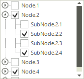

# Binding check boxes

Since R3 2014 __RadTreeView__ supports binding the check-boxes of the nodes to a field in the data. You just need to specify   the RadTreeView. __CheckedMember__ property. The following code snippet demonstrates how to setup hierarchical tree by using two separate DataTables:



{{source=..\SamplesCS\TreeView\DataBinding\BasicsHierarchyForm.cs region=CheckedMember}} 
{{source=..\SamplesVB\TreeView\DataBinding\BasicsHierarchyForm.vb region=CheckedMember}} 

````C#
            
DataTable parentDt = new DataTable("Parent");
parentDt.Columns.Add("MasterId", typeof(string));
parentDt.Columns.Add("Title", typeof(string));
parentDt.Columns.Add("IsActive", typeof(bool));
            
DataTable childDt = new DataTable("Child");
childDt.Columns.Add("ChildId", typeof(string));
childDt.Columns.Add("ParentId", typeof(string));
childDt.Columns.Add("Name", typeof(string));
childDt.Columns.Add("Status", typeof(bool));
            
string parentId = string.Empty;
string childId = string.Empty;
for (int i = 1; i <= 5; i++)
{
    parentId = Guid.NewGuid().ToString();
    parentDt.Rows.Add(parentId, "Node." + i, i % 2 == 0);
    
    for (int j = 1; j < 5; j++)
    {
        childId = Guid.NewGuid().ToString();
        childDt.Rows.Add(childId, parentId, "SubNode." + i + "." + j, j % 2 == 0);
    }
}
            
radTreeView1.DataSource = parentDt;
radTreeView1.RelationBindings.Add(new RelationBinding(childDt,null,"Name","MasterId","ParentId","ChildId","Status"));
radTreeView1.DisplayMember = "Title";
radTreeView1.ValueMember = "Id";
radTreeView1.CheckedMember = "IsActive";
radTreeView1.CheckBoxes = true;

````
````VB.NET
            
Dim parentDt As New DataTable("Parent")
parentDt.Columns.Add("MasterId", GetType(String))
parentDt.Columns.Add("Title", GetType(String))
parentDt.Columns.Add("IsActive", GetType(Boolean))
Dim childDt As New DataTable("Child")
childDt.Columns.Add("ChildId", GetType(String))
childDt.Columns.Add("ParentId", GetType(String))
childDt.Columns.Add("Name", GetType(String))
childDt.Columns.Add("Status", GetType(Boolean))
Dim parentId As String = String.Empty
Dim childId As String = String.Empty
For i As Integer = 1 To 5
    parentId = Guid.NewGuid().ToString()
    parentDt.Rows.Add(parentId, "Node." & i, i Mod 2 = 0)
    For j As Integer = 1 To 4
        childId = Guid.NewGuid().ToString()
        childDt.Rows.Add(childId, parentId, "SubNode." & i & "." & j, j Mod 2 = 0)
    Next
Next
radTreeView1.DataSource = parentDt
radTreeView1.RelationBindings.Add(New RelationBinding(childDt, Nothing, "Name", "MasterId", "ParentId", "ChildId", "Status"))
radTreeView1.DisplayMember = "Title"
radTreeView1.ValueMember = "Id"
radTreeView1.CheckedMember = "IsActive"
radTreeView1.CheckBoxes = True

````

{{endregion}}

## Binding CheckBoxes with Object Relational Hierarchy


Consider the following diagram which can be illustrated with the sample classes below: 

Note that the __IsActive__ and the __Status__ properties represent boolean data. 

{{source=..\SamplesCS\TreeView\DataBinding\BindingToRelatedData.cs region=DataClasses}} 
{{source=..\SamplesVB\TreeView\DataBinding\BindingToRelatedData.vb region=DataClasses}} 

````C#
    
public class Parent 
{
    public string ParentId { get; set; }
    
    public string Title { get; set; }
    
    public bool IsActive { get; set; }
    
    public List<Child> Children { get; set; }
        
    public Parent(string parentId, string title, bool isActive, List<Child> children)
    {
        this.ParentId = parentId;
        this.Title = title;
        this.IsActive = isActive;
        this.Children = children;
    }
}
    
public class Child
{
    public string ChildId { get; set; }
    
    public string ParentId { get; set; }
    
    public string Name { get; set; }
    
    public bool Status { get; set; }
        
    public Child(string childId, string parentId, string name, bool status)
    {
        this.ChildId = childId;
        this.ParentId = parentId;
        this.Name = name;
        this.Status = status;
    }
}

````
````VB.NET
Public Class Parent
    Public Property ParentId() As String
        Get
            Return m_ParentId
        End Get
        Set(value As String)
            m_ParentId = value
        End Set
    End Property
    Private m_ParentId As String
    Public Property Title() As String
        Get
            Return m_Title
        End Get
        Set(value As String)
            m_Title = value
        End Set
    End Property
    Private m_Title As String
    Public Property IsActive() As Boolean
        Get
            Return m_IsActive
        End Get
        Set(value As Boolean)
            m_IsActive = value
        End Set
    End Property
    Private m_IsActive As Boolean
    Public Property Children() As List(Of Child)
        Get
            Return m_Children
        End Get
        Set(value As List(Of Child))
            m_Children = value
        End Set
    End Property
    Private m_Children As List(Of Child)
    Public Sub New(parentId As String, title As String, isActive As Boolean, children As List(Of Child))
        Me.ParentId = parentId
        Me.Title = title
        Me.IsActive = isActive
        Me.Children = children
    End Sub
End Class
Public Class Child
    Public Property ChildId() As String
        Get
            Return m_ChildId
        End Get
        Set(value As String)
            m_ChildId = value
        End Set
    End Property
    Private m_ChildId As String
    Public Property ParentId() As String
        Get
            Return m_ParentId
        End Get
        Set(value As String)
            m_ParentId = value
        End Set
    End Property
    Private m_ParentId As String
    Public Property Name() As String
        Get
            Return m_Name
        End Get
        Set(value As String)
            m_Name = value
        End Set
    End Property
    Private m_Name As String
    Public Property Status() As Boolean
        Get
            Return m_Status
        End Get
        Set(value As Boolean)
            m_Status = value
        End Set
    End Property
    Private m_Status As Boolean
    Public Sub New(childId As String, parentId As String, name As String, status As Boolean)
        Me.ChildId = childId
        Me.ParentId = parentId
        Me.Name = name
        Me.Status = status
    End Sub
End Class

````

{{endregion}} 

The code snippet below illustrates how to bind the check-boxes coming from the described properties:


{{source=..\SamplesCS\TreeView\DataBinding\BindingToRelatedData.cs region=CheckedMember}} 
{{source=..\SamplesVB\TreeView\DataBinding\BindingToRelatedData.vb region=CheckedMember}} 

````C#
            
List<Parent> dataItems = new List<Parent>();
Parent currentParent;
Child currentChild;
List<Child> children;
string parentId = string.Empty;
string childId = string.Empty;
for (int i = 1; i <= 5; i++)
{
    parentId = Guid.NewGuid().ToString();
        
    children = new List<Child>();
    for (int j = 1; j < 5; j++)
    {
        childId = Guid.NewGuid().ToString();
        currentChild = new Child(childId, parentId, "SubNode." + i + "." + j, j % 2 == 0);
        children.Add(currentChild);
    }
    currentParent = new Parent(parentId, "Node." + i, i % 2 == 0,children);
    dataItems.Add(currentParent);
}
            
radTreeView1.DataSource = dataItems;
radTreeView1.DisplayMember = "Title\\Name";
radTreeView1.ChildMember = "Parent\\Children";
radTreeView1.CheckedMember = "IsActive\\Status";
radTreeView1.CheckBoxes = true;

````
````VB.NET
Dim dataItems As New List(Of Parent)()
Dim currentParent As Parent
Dim currentChild As Child
Dim children As List(Of Child)
Dim parentId As String = String.Empty
Dim childId As String = String.Empty
For i As Integer = 1 To 5
    parentId = Guid.NewGuid().ToString()
    children = New List(Of Child)()
    For j As Integer = 1 To 4
        childId = Guid.NewGuid().ToString()
        currentChild = New Child(childId, parentId, "SubNode." & i & "." & j, j Mod 2 = 0)
        children.Add(currentChild)
    Next
    currentParent = New Parent(parentId, "Node." & i, i Mod 2 = 0, children)
    dataItems.Add(currentParent)
Next
radTreeView1.DataSource = dataItems
radTreeView1.DisplayMember = "Title\Name"
radTreeView1.ChildMember = "Parent\Children"
radTreeView1.CheckedMember = "IsActive\Status"
radTreeView1.CheckBoxes = True

````

{{endregion}}