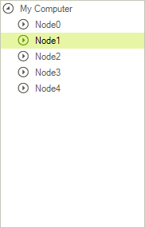

# Load On Demand

## 

The Load On Demand feature helps reduce performance and memory costs incurred when all nodes are loaded at one time.
          To benefit from this feature, you just need to handle the __NodesNeeded__ event where you can fill the parent nodes
          with subnodes.
          
          RadTreeView supports two modes of lazy loading nodes:
        

* Full lazy mode. In this mode, the NodesNeeded event is fired when you try to expand a node. Before expanding
              a node, RadTreeView is not aware whether this node has children or not. Therefore, you get expander signs for all nodes, regardless
              of whether these nodes will provide data when the end-user will try to expand them. To enable this feature, you should set
              the __LazyMode__ to *true*.
            

* Partial lazy mode. This is the default mode of RadTreeView. In this mode the NodesNeeded event is fired for
              all directly accessible nodes without any action required from the end-user. When the end-user expands a node,
              the NodesNeeded event is fired for the subnodes of this node. In short you are filling the first sub-level of a parent node in advance.
              Because of that, the parent nodes are aware of whether they have child nodes or not, and as a result, RadTreeView can determine whether
              an explander sign is required or not. To enable this feature, you should set the __LazyMode__
              property to *false* (this is the default value).
            

The event arguments of the NodesNeeded event contain
          the __Parent__ node that you are trying to expand and the
          __Nodes__ collection that you should fill with subnodes.
          
          The code snippet below demonstrates how you can handle the NodesNeeded event and load
          5 nodes to any expanded node, except to the child nodes of the root node. We will add sub-nodes only
          to some of the nodes at the first level. This will allow you to see the difference between the full and the partial
          lazy modes.
        

        Here is the result of this code snippet in the context of different lazy modes:
        

#### __[C#]__

{{source=..\SamplesCS\TreeView\DataBinding\LoadOnDemand.cs region=nodesNodes}}
	        void radTreeView1_NodesNeeded(object sender, NodesNeededEventArgs e)
	        {
	            if (e.Parent == null)
	            {
	                LoadRootNodes(e.Nodes);
	                return;
	            }
	
	            // If the parent node is one of the "My Computer" children, 
	            // then add sub-nodes to this node depending on its index
	            if (e.Parent.Level == 1)
	            {
	                if (e.Parent.Index % 3 == 0)
	                {
	                    return;
	                }
	            }
	
	            for (int i = 0; i < 5; i++)
	            {
	                RadTreeNode childNode = new RadTreeNode(string.Format("Node{0}", i));
	                e.Nodes.Add(childNode);
	            }
	        }
	
	        void LoadRootNodes(IList<RadTreeNode> nodes)
	        {
	            RadTreeNode mcNode = new RadTreeNode("My Computer");
	            nodes.Add(mcNode);
	        }
	{{endregion}}

#### __[VB.NET]__

{{source=..\SamplesVB\TreeView\DataBinding\LoadOnDemand.vb region=nodesNodes}}
	    Private Sub radTreeView1_NodesNeeded(ByVal sender As Object, ByVal e As NodesNeededEventArgs)
	        If e.Parent Is Nothing Then
	            LoadRootNodes(e.Nodes)
	            Return
	        End If
	
	        ' If the parent node is one of the "My Computer" children, 
	        ' then add sub-nodes to this node depending on its index
	        If e.Parent.Level = 1 Then
	            If e.Parent.Index Mod 3 = 0 Then
	                Return
	            End If
	        End If
	
	        For i As Integer = 0 To 4
	            Dim childNode As New RadTreeNode(String.Format("Node{0}", i))
	            e.Nodes.Add(childNode)
	        Next i
	    End Sub
	
	    Private Sub LoadRootNodes(ByVal nodes As IList(Of RadTreeNode))
	        Dim mcNode As New RadTreeNode("My Computer")
	        nodes.Add(mcNode)
	    End Sub
	{{endregion}}

* If __LazyMode__ is *true*, here is the result that we will get.
              When the end-user tries expanding nodes that do not have any sub-nodes, the plus sign will turn into a minus sign, but
              nothing else would change:
            

* When __LazyMode__ is *false* no plus/minus signs appear next to some of the nodes,
              because for these nodes RadTreeView already knows that there will be no sub-nodes:
            
