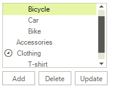
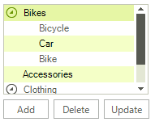
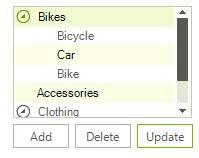

# Keep RadTreeView states on reset

The __RadTreeView__ is a control that allows you to visualize hierarchical structures of data in the form of a tree. However, when in bound mode, when a change in the underlying data source occurs, the tree needs to repopulate itself in order to get the latest changes. As a result, the __Expanded__ state of the available nodes, selection and scroll bar position are not kept. This article explains how to save the tree state prior the change and restore it afterwards.

The following code snippet demonstrates how to populate the __RadTreeView__ with hierarchical data.

{{source=..\SamplesCS\TreeView\HowTo\KeepTreeViewStates.cs region=BindToObjectRelationalData}} 
{{source=..\SamplesVB\TreeView\HowTo\KeepTreeViewStates.vb region=BindToObjectRelationalData}} 

````C#
        
public KeepTreeViewStates()
{
    InitializeComponent();
    
    BindingList<ChildObject> bikesChildren = new BindingList<ChildObject>();
    bikesChildren.Add(new ChildObject(567, "Bicycle"));
    bikesChildren.Add(new ChildObject(456, "Car"));
    bikesChildren.Add(new ChildObject(789, "Bike"));
    
    BindingList<ChildObject> clothingChildren = new BindingList<ChildObject>();
    clothingChildren.Add(new ChildObject(352, "T-shirt"));
    clothingChildren.Add(new ChildObject(981, "Dress"));
    
    List<ParentObject> parents = new List<ParentObject>();
    parents.Add(new ParentObject(182,"Bikes", bikesChildren));
    parents.Add(new ParentObject(346,"Accessories", null));
    parents.Add(new ParentObject(291,"Clothing", clothingChildren));
    
    radTreeView1.DataSource = parents;
    radTreeView1.DisplayMember = "Title\\Description";
    radTreeView1.ChildMember = "Parents\\Children";
    radTreeView1.MultiSelect = true;
}
        
public class ParentObject
{
    public int ID { get; set; }
    
    public string Title { get; set; }
    
    public BindingList<ChildObject> Children { get; set; }
    
    public ParentObject(int iD, string title, BindingList<ChildObject> children)
    {
        this.ID = iD;
        this.Title = title;
        this.Children = children;
    }
}
        
public class ChildObject: INotifyPropertyChanged
{ 
    public event PropertyChangedEventHandler PropertyChanged;
    
    private int id;
    private string description;
    
    public int ID
    {
        get
        {
            return this.id;
        }
        set
        {
            this.id = value;
            OnPropertyChanged("ID");
        }
    }
    
    public string Description
    {
        get
        {
            return this.description;
        }
        set
        {
            this.description = value;
            OnPropertyChanged("Description");
        }
    }
    
    public ChildObject(int iD, string description)
    {
        this.id = iD;
        this.description = description;
    }
    
    protected virtual void OnPropertyChanged(string propertyName)
    {
        if (PropertyChanged != null)
        {
            PropertyChanged(this, new PropertyChangedEventArgs(propertyName));
        }
    }
}

````
````VB.NET
Public Sub New()
    InitializeComponent()
    Dim bikesChildren As New BindingList(Of ChildObject)()
    bikesChildren.Add(New ChildObject(567, "Bicycle"))
    bikesChildren.Add(New ChildObject(456, "Car"))
    bikesChildren.Add(New ChildObject(789, "Bike"))
    Dim clothingChildren As New BindingList(Of ChildObject)()
    clothingChildren.Add(New ChildObject(352, "T-shirt"))
    clothingChildren.Add(New ChildObject(981, "Dress"))
    Dim parents As New List(Of ParentObject)()
    parents.Add(New ParentObject(182, "Bikes", bikesChildren))
    parents.Add(New ParentObject(346, "Accessories", Nothing))
    parents.Add(New ParentObject(291, "Clothing", clothingChildren))
    RadTreeView1.DataSource = parents
    RadTreeView1.DisplayMember = "Title\Description"
    RadTreeView1.ChildMember = "Parents\Children"
    RadTreeView1.MultiSelect = True
End Sub
Public Class ParentObject
    Public Property ID() As Integer
        Get
            Return m_ID
        End Get
        Set(value As Integer)
            m_ID = value
        End Set
    End Property
    Private m_ID As Integer
    Public Property Title() As String
        Get
            Return m_Title
        End Get
        Set(value As String)
            m_Title = value
        End Set
    End Property
    Private m_Title As String
    Public Property Children() As BindingList(Of ChildObject)
        Get
            Return m_Children
        End Get
        Set(value As BindingList(Of ChildObject))
            m_Children = value
        End Set
    End Property
    Private m_Children As BindingList(Of ChildObject)
    Public Sub New(iD As Integer, title As String, children As BindingList(Of ChildObject))
        Me.ID = iD
        Me.Title = title
        Me.Children = children
    End Sub
End Class
Public Class ChildObject
Implements System.ComponentModel.INotifyPropertyChanged
    Public Event PropertyChanged As PropertyChangedEventHandler Implements System.ComponentModel.INotifyPropertyChanged.PropertyChanged
    Private m_id As Integer
    Private m_description As String
    Public Property ID() As Integer
        Get
            Return Me.m_id
        End Get
        Set(value As Integer)
            Me.m_id = value
            OnPropertyChanged("ID")
        End Set
    End Property
    Public Property Description() As String
        Get
            Return Me.m_description
        End Get
        Set(value As String)
            Me.m_description = value
            OnPropertyChanged("Description")
        End Set
    End Property
    Public Sub New(iD As Integer, description As String)
        Me.m_id = iD
        Me.m_description = description
    End Sub
    Protected Overridable Sub OnPropertyChanged(propertyName As String)
        RaiseEvent PropertyChanged(Me, New PropertyChangedEventArgs(propertyName))
    End Sub
End Class

````

{{endregion}} 

On the left figure, you can see the tree with some selected and expanded nodes and the scroll bar in the middle of the tree. On the right figure, you see how the tree is collapsed after we add a node to its data source.

|Initial state|After a change in the data source occurs|
|-----|-----|
|||

Unfortunately, a solution of this cannot be added to the control as it depends on the case and there has to be logic added for the specific case to be handled. To keep the expanded and selected state of RadTreeView after a change in the data source occurs, we can use a Dictionary with some unique value for a key i.e. this could be the node’s Text, DataBoundItem, Value, or even an ID taken from the DataBoundItem and store the state for the node in it. The following example demonstrates how to create a simple structure - State, which will hold and describe the state of a node. The __SaveExpandedStates__ method is used to recursively iterate all nodes in RadTreeView and populate a dictionary with the nodes information. The __RestoreExpandedStates__ method is used to read the saved states from the dictionary, find the respective node and restore its state.

{{source=..\SamplesCS\TreeView\HowTo\KeepTreeViewStates.cs region=SaveRestore}} 
{{source=..\SamplesVB\TreeView\HowTo\KeepTreeViewStates.vb region=SaveRestore}} 

````C#
        
Dictionary<object, State> nodeStates = new Dictionary<object, State>();
        
struct State
{
    public bool Expanded { get; set; }
    
    public bool Selected { get; set; }
    
    public State(bool expanded, bool selected) : this()
    {
        this.Expanded = expanded;
        this.Selected = selected;
    }
}
        
private void SaveExpandedStates(RadTreeNode nodeToSave)
{
    {
        if (nodeToSave != null && nodeToSave.DataBoundItem != null)
        {
            if (! nodeStates.ContainsKey(nodeToSave.DataBoundItem))
            {
                nodeStates.Add(nodeToSave.DataBoundItem, new State(nodeToSave.Expanded, nodeToSave.Selected));
            }
            else
            {
                nodeStates[nodeToSave.DataBoundItem] = new State(nodeToSave.Expanded, nodeToSave.Selected);
            }
        }
        foreach (RadTreeNode childNode in nodeToSave.Nodes)
        {
            SaveExpandedStates(childNode);
        }
    }
}
        
private void RestoreExpandedStates(RadTreeNode nodeToRestore)
{
    if (nodeToRestore != null && nodeToRestore.DataBoundItem != null &&
        nodeStates.ContainsKey(nodeToRestore.DataBoundItem))
    {
        nodeToRestore.Expanded = nodeStates[nodeToRestore.DataBoundItem].Expanded;
        nodeToRestore.Selected = nodeStates[nodeToRestore.DataBoundItem].Selected;
    }
    
    foreach (RadTreeNode childNode in nodeToRestore.Nodes)
    {
        RestoreExpandedStates(childNode);
    }
}

````
````VB.NET
Private nodeStates As New Dictionary(Of Object, State)()
Private Structure State
    Public Property Expanded() As Boolean
        Get
            Return m_Expanded
        End Get
        Set(value As Boolean)
            m_Expanded = value
        End Set
    End Property
    Private m_Expanded As Boolean
    Public Property Selected() As Boolean
        Get
            Return m_Selected
        End Get
        Set(value As Boolean)
            m_Selected = value
        End Set
    End Property
    Private m_Selected As Boolean
    Public Sub New(expanded As Boolean, selected As Boolean)
        Me.Expanded = expanded
        Me.Selected = selected
    End Sub
End Structure
Private Sub SaveExpandedStates(nodeToSave As RadTreeNode)
    If True Then
        If nodeToSave IsNot Nothing AndAlso nodeToSave.DataBoundItem IsNot Nothing Then
            If Not nodeStates.ContainsKey(nodeToSave.DataBoundItem) Then
                nodeStates.Add(nodeToSave.DataBoundItem, New State(nodeToSave.Expanded, nodeToSave.Selected))
            Else
                nodeStates(nodeToSave.DataBoundItem) = New State(nodeToSave.Expanded, nodeToSave.Selected)
            End If
        End If
        For Each childNode As RadTreeNode In nodeToSave.Nodes
            SaveExpandedStates(childNode)
        Next
    End If
End Sub
Private Sub RestoreExpandedStates(nodeToRestore As RadTreeNode)
    If nodeToRestore IsNot Nothing AndAlso nodeToRestore.DataBoundItem IsNot Nothing AndAlso nodeStates.ContainsKey(nodeToRestore.DataBoundItem) Then
        nodeToRestore.Expanded = nodeStates(nodeToRestore.DataBoundItem).Expanded
        nodeToRestore.Selected = nodeStates(nodeToRestore.DataBoundItem).Selected
    End If
    For Each childNode As RadTreeNode In nodeToRestore.Nodes
        RestoreExpandedStates(childNode)
    Next
End Sub

````

{{endregion}} 

Once we have these methods implemented, we can use the dictionary to save the RadTreeView state prior the change occurs and restore it afterwards. In the example below, we are also saving and restoring the scroll bar position.

{{source=..\SamplesCS\TreeView\HowTo\KeepTreeViewStates.cs region=KeepTreeViewStates}} 
{{source=..\SamplesVB\TreeView\HowTo\KeepTreeViewStates.vb region=KeepTreeViewStates}} 

````C#
        
private void radButtonAdd_Click(object sender, EventArgs e)
{
    int scrollBarValue = radTreeView1.VScrollBar.Value;           
    foreach (RadTreeNode nodeToSave in radTreeView1.Nodes)
    {
        SaveExpandedStates(nodeToSave);
    }
    
    ParentObject parent = radTreeView1.Nodes[0].DataBoundItem as ParentObject;
    parent.Children.Add(new ChildObject(673,"New child"));    
    
    radTreeView1.TreeViewElement.Update(RadTreeViewElement.UpdateActions.ItemAdded);
    
    foreach (RadTreeNode nodeToRestore in radTreeView1.Nodes)
    {
        RestoreExpandedStates(nodeToRestore);
    }
    radTreeView1.VScrollBar.Value = scrollBarValue;
}
        
private void radButtonDelete_Click(object sender, EventArgs e)
{
    int scrollBarValue = radTreeView1.VScrollBar.Value;           
    foreach (RadTreeNode nodeToSave in radTreeView1.Nodes)
    {
        SaveExpandedStates(nodeToSave);
    }
    
    ParentObject parent = radTreeView1.Nodes[0].DataBoundItem as ParentObject;
    parent.Children.Clear();
    
    radTreeView1.TreeViewElement.Update(RadTreeViewElement.UpdateActions.ItemRemoved);
    
    foreach (RadTreeNode nodeToRestore in radTreeView1.Nodes)
    {
        RestoreExpandedStates(nodeToRestore);
    }
    radTreeView1.VScrollBar.Value = scrollBarValue;
}
        
private void radButtonUpdate_Click(object sender, EventArgs e)
{
    int scrollBarValue = radTreeView1.VScrollBar.Value;           
    foreach (RadTreeNode nodeToSave in radTreeView1.Nodes)
    {
        SaveExpandedStates(nodeToSave);
    }
    
    ParentObject parent = radTreeView1.Nodes[2].DataBoundItem as ParentObject;
    parent.Children[1].Description = "New description";
    
    foreach (RadTreeNode nodeToRestore in radTreeView1.Nodes)
    {
        RestoreExpandedStates(nodeToRestore);
    }
    radTreeView1.VScrollBar.Value = scrollBarValue;
}

````
````VB.NET
Private Sub radButtonAdd_Click(sender As Object, e As EventArgs) Handles RadButtonAdd.Click
    Dim scrollBarValue As Integer = RadTreeView1.VScrollBar.Value
    For Each nodeToSave As RadTreeNode In RadTreeView1.Nodes
        SaveExpandedStates(nodeToSave)
    Next
    Dim parent As ParentObject = TryCast(RadTreeView1.Nodes(0).DataBoundItem, ParentObject)
    parent.Children.Add(New ChildObject(673, "New child"))
    RadTreeView1.TreeViewElement.Update(RadTreeViewElement.UpdateActions.ItemAdded)
    For Each nodeToRestore As RadTreeNode In RadTreeView1.Nodes
        RestoreExpandedStates(nodeToRestore)
    Next
    RadTreeView1.VScrollBar.Value = scrollBarValue
End Sub
Private Sub radButtonDelete_Click(sender As Object, e As EventArgs) Handles RadButtonDelete.Click
    Dim scrollBarValue As Integer = RadTreeView1.VScrollBar.Value
    For Each nodeToSave As RadTreeNode In RadTreeView1.Nodes
        SaveExpandedStates(nodeToSave)
    Next
    Dim parent As ParentObject = TryCast(RadTreeView1.Nodes(0).DataBoundItem, ParentObject)
    parent.Children.Clear()
    RadTreeView1.TreeViewElement.Update(RadTreeViewElement.UpdateActions.ItemRemoved)
    For Each nodeToRestore As RadTreeNode In RadTreeView1.Nodes
        RestoreExpandedStates(nodeToRestore)
    Next
    RadTreeView1.VScrollBar.Value = scrollBarValue
End Sub
Private Sub radButtonUpdate_Click(sender As Object, e As EventArgs) Handles RadButtonUpdate.Click
    Dim scrollBarValue As Integer = RadTreeView1.VScrollBar.Value
    For Each nodeToSave As RadTreeNode In RadTreeView1.Nodes
        SaveExpandedStates(nodeToSave)
    Next
    Dim parent As ParentObject = TryCast(RadTreeView1.Nodes(2).DataBoundItem, ParentObject)
    parent.Children(1).Description = "New description"
    For Each nodeToRestore As RadTreeNode In RadTreeView1.Nodes
        RestoreExpandedStates(nodeToRestore)
    Next
    RadTreeView1.VScrollBar.Value = scrollBarValue
End Sub

````

{{endregion}} 

Now, using these methods the tree states will be restored accordingly.

|Initial state|After a change in the data source occurs|
|------|------|
|||

# See Also
* [Assign RadScreenTip to nodes]()

