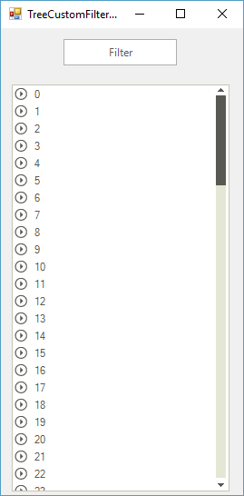

# Custom Filtering

Custom filtering is a flexible mechanism for filtering RadTreeView nodes by using custom logic.It has a higher priority than the applied FilterDescriptors.
        

In order to apply custom logic for filtering, you have to create a [Predicate](http://msdn.microsoft.com/en-us/library/bfcke1bz.aspx). Here is an example of a __Predicate__ which will return just the nodes which text is longer than one char:
        

#### Creating predicate

{{source=..\SamplesCS\TreeView\WorkingWithNodes\TreeCustomFiltering.cs region=CustomFiltering2}} 
{{source=..\SamplesVB\TreeView\WorkingWithNodes\TreeCustomFiltering.vb region=CustomFiltering2}} 

````C#
private bool FilterNode(RadTreeNode node)
{
    if (node.Text.Length > 1)
    {
        return true;
    }
    return false;
}

````
````VB.NET
Private Function FilterNode(node As RadTreeNode) As Boolean
    If node.Text.Length > 1 Then
        Return True
    End If
    Return False
End Function

````

{{endregion}} 

To set the __Predicate__ to RadTreeView, use the __FilterPredicate__ property of the control:
    	
#### Applying predicate

{{source=..\SamplesCS\TreeView\WorkingWithNodes\TreeCustomFiltering.cs region=CustomFiltering1}} 
{{source=..\SamplesVB\TreeView\WorkingWithNodes\TreeCustomFiltering.vb region=CustomFiltering1}} 

````C#
radTreeView1.TreeViewElement.FilterPredicate = FilterNode;

````
````VB.NET
RadTreeView1.TreeViewElement.FilterPredicate = AddressOf FilterNode

````

{{endregion}}

At the end, in order to apply the filter to the control, just set the __Filter__ property to any string, which will invoke the filtering operation:
    	
#### Invoke filtering

{{source=..\SamplesCS\TreeView\WorkingWithNodes\TreeCustomFiltering.cs region=CustomFiltering3}} 
{{source=..\SamplesVB\TreeView\WorkingWithNodes\TreeCustomFiltering.vb region=CustomFiltering3}} 

````C#
private void radButton1_Click(object sender, EventArgs e)
{
    this.radTreeView1.Filter = "Custom";
}

````
````VB.NET
Private Sub RadButton1_Click(sender As System.Object, e As System.EventArgs) Handles RadButton1.Click
    Me.RadTreeView1.Filter = "Custom"
End Sub

````

{{endregion}} 

| Here you have nodes from 1-100 | After the filtering the nodes are only from 10-100, since nodes 1-9 contain just one char as text |
| ------ | ------ |
|||
