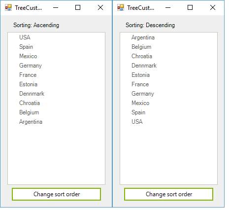

# Custom Sorting

Custom sorting is a flexible mechanism which allows you to replace the default sorting logic with your own logic. The custom sorting operation has higher priority that the default sorting.

To apply your own logic for sorting, you have to create a class which inherits from __TreeNodeComparer__ and override its __Compare__ method, where you can add your custom logic. Here is a sample where we will reverse the sorting of the tree i.e. when sorting *Ascending* we will actually sort in *Descending* order and vice versa. 

#### Creating custom comparer

{{source=..\SamplesCS\TreeView\WorkingWithNodes\TreeCustomSorting.cs region=CustomSorting3}} 
{{source=..\SamplesVB\TreeView\WorkingWithNodes\TreeCustomSorting.vb region=CustomSorting3}} 

````C#
class MyComparer : TreeNodeComparer
{
    public MyComparer(RadTreeViewElement treeView)
        : base(treeView)
    {
    }
    public override int Compare(RadTreeNode x, RadTreeNode y)
    {
        if (this.TreeViewElement.SortOrder == SortOrder.Descending)
        {
            return x.Text.CompareTo(y.Text);
        }
        return x.Text.CompareTo(y.Text) * -1;
    }
}

````
````VB.NET
Class MyComparer
    Inherits TreeNodeComparer
    Public Sub New(treeView As RadTreeViewElement)
        MyBase.New(treeView)
    End Sub
    Public Overrides Function Compare(x As RadTreeNode, y As RadTreeNode) As Integer
        If Me.TreeViewElement.SortOrder = SortOrder.Descending Then
            Return x.Text.CompareTo(y.Text)
        End If
        Return x.Text.CompareTo(y.Text) * -1
    End Function
End Class

````

{{endregion}} 

Once the comparer is created we have to assign it to the RadTreeView control:

#### Assign the custom comparer

{{source=..\SamplesCS\TreeView\WorkingWithNodes\TreeCustomSorting.cs region=CustomSorting1}} 
{{source=..\SamplesVB\TreeView\WorkingWithNodes\TreeCustomSorting.vb region=CustomSorting1}} 

````C#
radTreeView1.TreeViewElement.Comparer = new MyComparer(this.radTreeView1.TreeViewElement);

````
````VB.NET
RadTreeView1.TreeViewElement.Comparer = New MyComparer(Me.RadTreeView1.TreeViewElement)

````

{{endregion}} 

That is all that you have to do. To test this scenario, you can add a button and a label to the form, where you will change and print the sort order. This will allow you to check whether the sorting is reversed:

{{source=..\SamplesCS\TreeView\WorkingWithNodes\TreeCustomSorting.cs region=CustomSorting2}} 
{{source=..\SamplesVB\TreeView\WorkingWithNodes\TreeCustomSorting.vb region=CustomSorting2}} 

````C#
private void radButton1_Click(object sender, EventArgs e)
{
    if (radTreeView1.SortOrder == SortOrder.None)
    {
        radTreeView1.SortOrder = SortOrder.Ascending;
        radLabel1.Text = "Sorting: Ascending";
    }
    else if (radTreeView1.SortOrder == SortOrder.Ascending)
    {
        radTreeView1.SortOrder = SortOrder.Descending;
        radLabel1.Text = "Sorting: Descending";
    }
    else
    {
        radTreeView1.SortOrder = SortOrder.None;
        radLabel1.Text = "Sorting: None";
    }
}

````
````VB.NET
Private Sub RadButton1_Click(sender As System.Object, e As System.EventArgs)
    If RadTreeView1.SortOrder = SortOrder.None Then
        RadTreeView1.SortOrder = SortOrder.Ascending
        radLabel1.Text = "Sorting: Ascending"
    ElseIf RadTreeView1.SortOrder = SortOrder.Ascending Then
        RadTreeView1.SortOrder = SortOrder.Descending
        radLabel1.Text = "Sorting: Descending"
    Else
        RadTreeView1.SortOrder = SortOrder.None
        RadLabel1.Text = "None"
    End If
End Sub

````

{{endregion}} 


