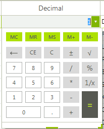
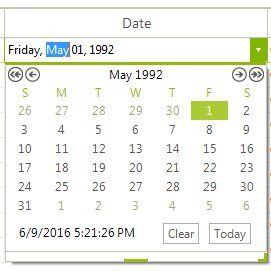
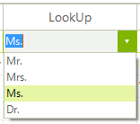
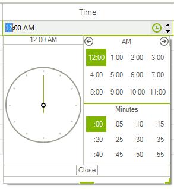
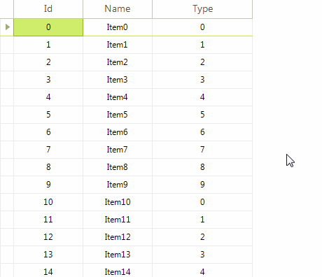

# Using Custom Editors

By default, __RadVirtualGrid__ supports the following editors:

|Editor type|Description|Image|
|----|----|----|
|__VirtualGridCalculatorEditor__|Represents a calculator editor||
|__VirtualGridDateTimeEditor__|Represents a date time editor||
|__VirtualGridDropDownListEditor__|Represents a DropDownList editor||
|__VirtualGridMaskedEditBoxEditor__|Represents a masked editbox editor||
|__VirtualGridSpinEditor__|Represents a spin editor||
|__VirtualGridTextBoxControlEditor__|Represents a textbox control editor||
|__VirtualGridTextBoxEditor__|Represents a textbox editor||
|__VirtualGridTimePickerEditor__|Represents a time picker editor||
|__VirtualGridBrowseEditor__|Represents a browse editor||
|__VirtualGridColorPickerEditor__|Represents a color editor||

Most of the grid editors inherit from __BaseVirtualGridEditor__. The following steps and code snippet demonstrate how to replace the standard editor with a custom one containing a __RadMultiColumnComboBoxElement__:

1. Create a class that inherits __BaseVirtualGridEditor__.
2. Override its __CreateEditorElement__ method and return a new instance of __RadMultiColumnComboBoxElement__.
3. Introduce __DataSource__, __ValueMember__, __DisplayMember__ properties of the custom editor in order to data bind the editor element.
4. Override the __Value__ property and manage the editor's value considering the RadMultiColumnComboBoxElement.__SelectedValue__ property.
5. Subscribe to the RadVirtualGrid.__EditorRequired__ event and replace the default editor for the desired column with your custom one.



#### Creating MultiColumnComboBoxVirtualGridEditor 

{{source=..\SamplesCS\VirtualGrid\Editing\VirtualGridCustomEditor.cs region=MyEditor}} 
{{source=..\SamplesVB\Virtualgrid\Editing\VirtualGridCustomEditor.vb region=MyEditor}}
````C#
 public class MultiColumnComboBoxVirtualGridEditor : BaseVirtualGridEditor
        {
            protected override Telerik.WinControls.RadElement CreateEditorElement()
            {
                return new RadMultiColumnComboBoxElement();
            }

            public override object Value
            {
                get
                {
                    RadMultiColumnComboBoxElement editor = this.EditorElement as RadMultiColumnComboBoxElement;

                    if (editor.SelectedValue != null)
                    {
                        if (!string.IsNullOrEmpty(editor.ValueMember))
                        {
                            return editor.SelectedValue;
                        }
                    }
                    return -1;
                }
                set
                {
                    RadMultiColumnComboBoxElement editor = this.EditorElement as RadMultiColumnComboBoxElement;

                    if (value == null)
                    {
                        editor.SelectedIndex = -1;
                    }
                    else if (editor.ValueMember != null)
                    {
                        editor.SelectedValue = value;
                    }
                }
            }

            public object DataSource
            {
                get
                {
                    RadMultiColumnComboBoxElement editorElement = this.EditorElement as RadMultiColumnComboBoxElement;

                    return editorElement.DataSource;
                }
                set
                {
                    RadMultiColumnComboBoxElement editorElement = this.EditorElement as RadMultiColumnComboBoxElement;
                    if (editorElement.BindingContext == null)
                    {
                        editorElement.BindingContext = new BindingContext();
                    }
                    editorElement.DataSource = value;
                }
            }

            public string ValueMember
            {
                get
                {
                    RadMultiColumnComboBoxElement editorElement = this.EditorElement as RadMultiColumnComboBoxElement;
                    return editorElement.ValueMember;
                }
                set
                {
                    RadMultiColumnComboBoxElement editorElement = this.EditorElement as RadMultiColumnComboBoxElement;
                    editorElement.ValueMember = value;
                }
            }

            public string DisplayMember
            {
                get
                {
                    RadMultiColumnComboBoxElement editorElement = this.EditorElement as RadMultiColumnComboBoxElement;
                    return editorElement.DisplayMember;
                }
                set
                {
                    RadMultiColumnComboBoxElement editorElement = this.EditorElement as RadMultiColumnComboBoxElement;
                    editorElement.DisplayMember = value;
                }
            }
        }

        private void radVirtualGrid1_EditorRequired(object sender, Telerik.WinControls.UI.VirtualGridEditorRequiredEventArgs e)
        {
            if (e.ColumnIndex == 2)
            {
                MultiColumnComboBoxVirtualGridEditor editor = new MultiColumnComboBoxVirtualGridEditor();
                DataTable dt = new DataTable();
                dt.Columns.Add("Id", typeof(int));
                dt.Columns.Add("Name", typeof(string));
                dt.Rows.Add(-1, "");
                for (int i = 0; i <= 9; i++)
                {
                    dt.Rows.Add(i, "Item" + i);
                }
                editor.DataSource = dt;
                editor.ValueMember = "Id";
                editor.DisplayMember = "Name";
                e.Editor = editor;
            }
        }

````
````VB.NET
Public Class MultiColumnComboBoxVirtualGridEditor
        Inherits BaseVirtualGridEditor
        Protected Overrides Function CreateEditorElement() As Telerik.WinControls.RadElement
            Return New RadMultiColumnComboBoxElement()
        End Function

        Public Overrides Property Value() As Object
            Get
                Dim editor As RadMultiColumnComboBoxElement = TryCast(Me.EditorElement, RadMultiColumnComboBoxElement)

                If editor.SelectedValue IsNot Nothing Then
                    If Not String.IsNullOrEmpty(editor.ValueMember) Then
                        Return editor.SelectedValue
                    End If
                End If
                Return -1
            End Get
            Set(value As Object)
                Dim editor As RadMultiColumnComboBoxElement = TryCast(Me.EditorElement, RadMultiColumnComboBoxElement)

                If value Is Nothing Then
                    editor.SelectedIndex = -1
                ElseIf editor.ValueMember IsNot Nothing Then
                    editor.SelectedValue = value
                End If
            End Set
        End Property

        Public Property DataSource() As Object
            Get
                Dim editorElement As RadMultiColumnComboBoxElement = TryCast(Me.EditorElement, RadMultiColumnComboBoxElement)

                Return editorElement.DataSource
            End Get
            Set(value As Object)
                Dim editorElement As RadMultiColumnComboBoxElement = TryCast(Me.EditorElement, RadMultiColumnComboBoxElement)
                If editorElement.BindingContext Is Nothing Then
                    editorElement.BindingContext = New BindingContext()
                End If
                editorElement.DataSource = value
            End Set
        End Property

        Public Property ValueMember() As String
            Get
                Dim editorElement As RadMultiColumnComboBoxElement = TryCast(Me.EditorElement, RadMultiColumnComboBoxElement)
                Return editorElement.ValueMember
            End Get
            Set(value As String)
                Dim editorElement As RadMultiColumnComboBoxElement = TryCast(Me.EditorElement, RadMultiColumnComboBoxElement)
                editorElement.ValueMember = value
            End Set
        End Property

        Public Property DisplayMember() As String
            Get
                Dim editorElement As RadMultiColumnComboBoxElement = TryCast(Me.EditorElement, RadMultiColumnComboBoxElement)
                Return editorElement.DisplayMember
            End Get
            Set(value As String)
                Dim editorElement As RadMultiColumnComboBoxElement = TryCast(Me.EditorElement, RadMultiColumnComboBoxElement)
                editorElement.DisplayMember = value
            End Set
        End Property
    End Class

    Private Sub radVirtualGrid1_EditorRequired(sender As Object, e As Telerik.WinControls.UI.VirtualGridEditorRequiredEventArgs)
        If e.ColumnIndex = 2 Then
            Dim editor As New MultiColumnComboBoxVirtualGridEditor()
            Dim dt As New DataTable()
            dt.Columns.Add("Id", GetType(Integer))
            dt.Columns.Add("Name", GetType(String))
            dt.Rows.Add(-1, "")
            For i As Integer = 0 To 9
                dt.Rows.Add(i, "Item" & i)
            Next
            editor.DataSource = dt
            editor.ValueMember = "Id"
            editor.DisplayMember = "Name"
            e.Editor = editor
        End If
    End Sub

```` 

{{endregion}}

