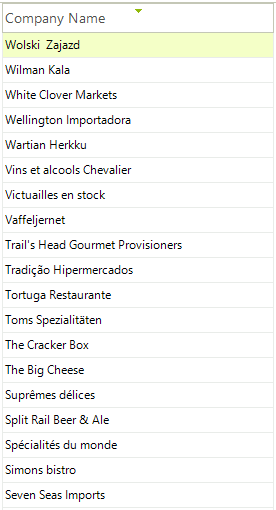
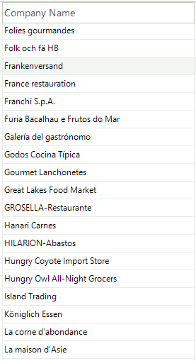

# Sorting

## Single Column Sorting

By default __RadVirtualGrid__ allows you to sort by any column. The end-user should click on the header of the desired column to toggle between the sorting modes:

* Clicking the column header sorts by that column. The column header displays an upward pointing arrow.

* Clicking the header for a second time sorts by that column in descending order. The column header displays a downward pointing arrow.

* “Clear Sorting” from the context menu returns to a natural sort (i.e. no sorting). No arrow is displayed on the column header.

The screenshot below shows sorting by the "ProductName" column:
   

| Ascending | Descending | Natural Sort (Unsorted) |
| ------ | ------ | ------ |
||||

## Sorting in Hierarchical Tables

The default behavior of the grid is to allow all views of the data to be sorted, including the master grid and all child grid views. Sorting properties for the grid and each of the templates allows sorting for each view to be enabled independently. The example below shows the master grid view of categories "Category Name" column sorted in descending order and the child view of products "Product Name" column sorted in ascending order.

## Sorting Context Menus

Sorting can be invoked through right clicking the column heading to display the context menu. The menu will allow you to choose from Sort Ascending, Sort Descending and to Clear Sorting. 
