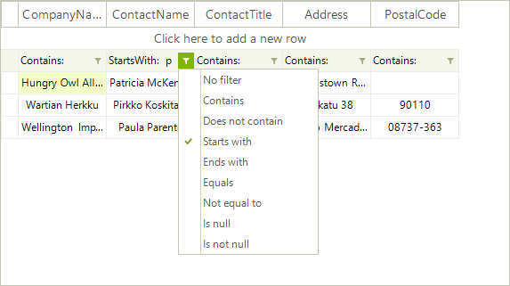
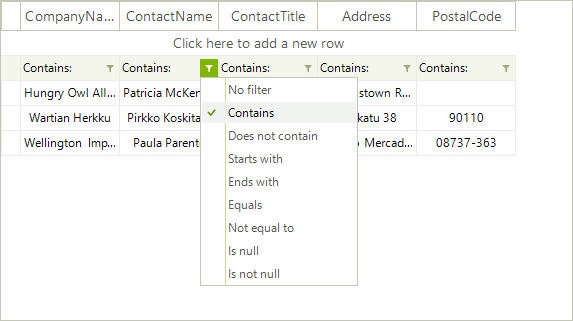
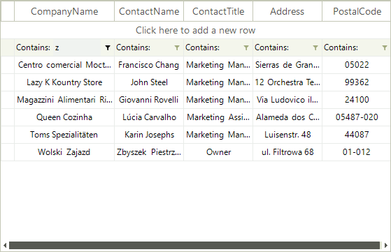

# Filtering Overview

__RadVirtualGrid__  supports data filtering. Set the RadVirtualGrid.__AllowFiltering__ property to *true*.



#### Enabling the user filtering 

{{source=..\SamplesCS\VirtualGrid\Filtering\VirtualGridFiltering.cs region=AllowFiltering}} 
{{source=..\SamplesVB\VirtualGrid\Filtering\VirtualGridFiltering.vb region=AllowFiltering}}

````C#
this.radVirtualGrid1.AllowFiltering = true;

````
````VB.NET
Me.RadVirtualGrid1.AllowFiltering = True
```` 

{{endregion}}

When filtering is enabled, each column displays a filter button beneath the corresponding header which controls the filter operator:



When clicking over the filter cell, the filter text box is activated:



It is necessary to handle the __FilterChanged__ event which is fired once the __FilterDescriptors__ collection is changed. In the event handler you should extract the filtered data from the external data source.

>note Please refer to the [Populating with data]() help article which demonstrates how to extract the necessary data and fill the virtual grid with data.


The following example demonstrates how to achieve filtering functionality in __RadVirtualGrid__ filled with Northwind.Customers table:

{{source=..\SamplesCS\VirtualGrid\Filtering\VirtualGridFiltering.cs region=Filtering}} 
{{source=..\SamplesVB\VirtualGrid\Filtering\VirtualGridFiltering.vb region=Filtering}}

````C#
private void radVirtualGrid1_FilterChanged(object sender, VirtualGridEventArgs e)
{
    SelectData();
}

private readonly string selectCommand = "SELECT CustomerID, CompanyName, ContactName, ContactTitle, Address, PostalCode FROM Customers";
private string[] columnNames = new string[] { "CompanyName", "ContactName", "ContactTitle", "Address", "PostalCode" };
List<Customer> data = new List<Customer>();

private void SelectData()
{
    string filterExpression = this.radVirtualGrid1.FilterDescriptors.Expression;
    
    if (!string.IsNullOrEmpty(filterExpression))
    {
        filterExpression = "WHERE " + filterExpression;
    }
    
    string commandString = String.Format("{0} {1}", selectCommand, filterExpression);
    using (System.Data.OleDb.OleDbCommand command = new System.Data.OleDb.OleDbCommand(commandString))
    {
        command.Connection = new System.Data.OleDb.OleDbConnection(Settings.Default.NwindConnectionString);
        command.Connection.Open();
        IDataReader reader = command.ExecuteReader();
        data.Clear();
        
        while (reader.Read())
        {
            Customer customer = new Customer(
                Convert.ToString(reader[0]),
                Convert.ToString(reader[1]),
                Convert.ToString(reader[2]),
                Convert.ToString(reader[3]),
                Convert.ToString(reader[4]),
                Convert.ToString(reader[5]));
            data.Add(customer);
        }
        
        command.Connection.Close();
    }
    
    this.radVirtualGrid1.RowCount = data.Count;
}

private void radVirtualGrid1_CellValueNeeded(object sender, Telerik.WinControls.UI.VirtualGridCellValueNeededEventArgs e)
{
    if (e.ColumnIndex < 0)
        return;
    if (e.RowIndex == RadVirtualGrid.HeaderRowIndex)
    {
        e.Value = columnNames[e.ColumnIndex];
    }
    
    if (e.RowIndex < 0)
    {
        e.FieldName = columnNames[e.ColumnIndex];
    }
    
    if (e.RowIndex >= 0 && e.RowIndex < data.Count)
    {
        e.Value = data[e.RowIndex][e.ColumnIndex];
    }
}

private void VirtualGridFiltering_Load(object sender, EventArgs e)
{
    this.radVirtualGrid1.ColumnCount = columnNames.Length;
    this.radVirtualGrid1.CellValueNeeded += radVirtualGrid1_CellValueNeeded;
    this.radVirtualGrid1.FilterChanged += radVirtualGrid1_FilterChanged;
    SelectData();
}

public class Customer
{
    public string CustomerId { get; set; }
    
    public string CompanyName { get; set; }
    
    public string ContactName { get; set; }
    
    public string ContactTitle { get; set; }
    
    public string Address { get; set; }
    
    public string PostalCode { get; set; }
    
    public Customer(string customerId, string companyName, string contactName, string contactTitle, string address, string postalCode)
    {
        this.CustomerId = customerId;
        this.CompanyName = companyName;
        this.ContactName = contactName;
        this.ContactTitle = contactTitle;
        this.Address = address;
        this.PostalCode = postalCode;
    }
    
    public string this[int i]
    {
        get
        {
            switch (i)
            {
                case 0:
                    return CompanyName;
                case 1:
                    return ContactName;
                case 2:
                    return ContactTitle;
                case 3:
                    return Address;
                case 4:
                    return PostalCode;
                default:
                    return String.Empty;
            }
        }
    }
}


````
````VB.NET
Private Sub radVirtualGrid1_FilterChanged(sender As Object, e As VirtualGridEventArgs)
    SelectData()
End Sub

Private ReadOnly selectCommand As String = "SELECT CustomerID, CompanyName, ContactName, ContactTitle, Address, PostalCode FROM Customers"
Private columnNames As String() = New String() {"CompanyName", "ContactName", "ContactTitle", "Address", "PostalCode"}
Private data As New List(Of Customer)()

Private Sub SelectData()
    Dim filterExpression As String = Me.RadVirtualGrid1.FilterDescriptors.Expression

    If Not String.IsNullOrEmpty(filterExpression) Then
        filterExpression = Convert.ToString("WHERE ") & filterExpression
    End If

    Dim commandString As String = [String].Format("{0} {1}", selectCommand, filterExpression)
    Using command As New System.Data.OleDb.OleDbCommand(commandString)
        command.Connection = New System.Data.OleDb.OleDbConnection(My.Settings.NwindConnectionString)
        command.Connection.Open()
        Dim reader As IDataReader = command.ExecuteReader()
        data.Clear()

        While reader.Read()
            Dim customer As New Customer(Convert.ToString(reader(0)), Convert.ToString(reader(1)), Convert.ToString(reader(2)), _
                                         Convert.ToString(reader(3)), Convert.ToString(reader(4)), Convert.ToString(reader(5)))
            data.Add(customer)
        End While

        command.Connection.Close()
    End Using

    Me.RadVirtualGrid1.RowCount = data.Count
End Sub

Private Sub radVirtualGrid1_CellValueNeeded(sender As Object, e As Telerik.WinControls.UI.VirtualGridCellValueNeededEventArgs)
    If e.ColumnIndex < 0 Then
        Return
    End If
    If e.RowIndex = RadVirtualGrid.HeaderRowIndex Then
        e.Value = columnNames(e.ColumnIndex)
    End If

    If e.RowIndex < 0 Then
        e.FieldName = columnNames(e.ColumnIndex)
    End If

    If e.RowIndex >= 0 AndAlso e.RowIndex < data.Count Then
        e.Value = data(e.RowIndex)(e.ColumnIndex)
    End If
End Sub

Private Sub VirtualGridFiltering_Load(sender As Object, e As EventArgs) Handles Me.Load
    Me.RadVirtualGrid1.ColumnCount = columnNames.Length
    AddHandler Me.RadVirtualGrid1.CellValueNeeded, AddressOf radVirtualGrid1_CellValueNeeded
    AddHandler Me.RadVirtualGrid1.FilterChanged, AddressOf radVirtualGrid1_FilterChanged
    SelectData()
End Sub

Public Class Customer
    Public Property CustomerId() As String
        Get
            Return m_CustomerId
        End Get
        Set(value As String)
            m_CustomerId = value
        End Set
    End Property
    Private m_CustomerId As String

    Public Property CompanyName() As String
        Get
            Return m_CompanyName
        End Get
        Set(value As String)
            m_CompanyName = value
        End Set
    End Property
    Private m_CompanyName As String

    Public Property ContactName() As String
        Get
            Return m_ContactName
        End Get
        Set(value As String)
            m_ContactName = value
        End Set
    End Property
    Private m_ContactName As String

    Public Property ContactTitle() As String
        Get
            Return m_ContactTitle
        End Get
        Set(value As String)
            m_ContactTitle = value
        End Set
    End Property
    Private m_ContactTitle As String

    Public Property Address() As String
        Get
            Return m_Address
        End Get
        Set(value As String)
            m_Address = value
        End Set
    End Property
    Private m_Address As String

    Public Property PostalCode() As String
        Get
            Return m_PostalCode
        End Get
        Set(value As String)
            m_PostalCode = value
        End Set
    End Property
    Private m_PostalCode As String

    Public Sub New(customerId As String, companyName As String, contactName As String, contactTitle As String, address As String, postalCode As String)
        Me.CustomerId = customerId
        Me.CompanyName = companyName
        Me.ContactName = contactName
        Me.ContactTitle = contactTitle
        Me.Address = address
        Me.PostalCode = postalCode
    End Sub

    Default Public ReadOnly Property Item(i As Integer) As String
        Get
            Select Case i
                Case 0
                    Return CompanyName
                Case 1
                    Return ContactName
                Case 2
                    Return ContactTitle
                Case 3
                    Return Address
                Case 4
                    Return PostalCode
                Case Else
                    Return [String].Empty
            End Select
        End Get
    End Property
End Class

```` 

{{endregion}}

>note It is neccessary to specify the __FieldName__ property for the filter cells.