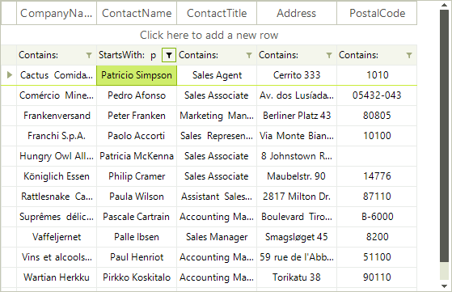

# Setting Filters Programmatically
__RadVirtualGrid__  includes __FilterDescriptors__ property which stores filter descriptors used for filtering operation. The most important classes are:

* __FilterDescriptor__ - implements filtering property (field) name, filtering operator and value. Used to define simple filtering expressions like Country = "Germany".

* __CompositeFilterDescriptor__ - a collection of multiple filter descriptors with logical operator. Used to define complex filtering expressions like (Country = "Germany" AND (City = "Berlin" OR City = "Aachen")) .

>caution Before proceeding with this article, please refer to the [Filtering Overview]() help article which demonstrates how to achieve the filtering functionality in __RadVirtualGrid__.

# Simple descriptors

__FilterDescriptor__'s major properties:

* __PropertyName__ - defines the property, which values will be filtered.

* __Operator__ - allows you to define the type of operator. The possible values are: *Contains*, *Does not contain*, *Starts with*, *Ends with*, *Equals*, *Not equal to*, *Is null*, *Is not null*.

* __Value__ - the value your data will be compared against.

When you add a new descriptor to the collection, the data is automatically filtered according to it.



#### Using simple filter descriptor 

{{source=..\SamplesCS\VirtualGrid\Filtering\VirtualGridFiltering.cs region=SimpleDescriptors}} 
{{source=..\SamplesVB\VirtualGrid\Filtering\VirtualGridFiltering.vb region=SimpleDescriptors}}

````C#
            
FilterDescriptor filter = new FilterDescriptor();
filter.PropertyName = "ContactName";
filter.Operator = FilterOperator.StartsWith ;
filter.Value = "p";
filter.IsFilterEditor = true;
 this.radVirtualGrid1.FilterDescriptors.Add(filter);

````
````VB.NET
Dim filter As New FilterDescriptor()
filter.PropertyName = "ContactName"
filter.[Operator] = FilterOperator.StartsWith
filter.Value = "p"
filter.IsFilterEditor = True
Me.RadVirtualGrid1.FilterDescriptors.Add(filter)

```` 

{{endregion}}

# Composite descriptors

To filter a single data field by multiple values, you have to use the __CompositeFilterDescriptor__ object. It contains a collection of filter descriptors objects and the logical operator for that filters.


#### Using CompositeFilterDescriptor

{{source=..\SamplesCS\VirtualGrid\Filtering\VirtualGridFiltering.cs region=CompositeDescriptors}} 
{{source=..\SamplesVB\VirtualGrid\Filtering\VirtualGridFiltering.vb region=CompositeDescriptors}}

````C#
            
CompositeFilterDescriptor compositeFilter = new CompositeFilterDescriptor();
compositeFilter.FilterDescriptors.Add(new FilterDescriptor("ContactName", FilterOperator.StartsWith,"p"));
compositeFilter.FilterDescriptors.First().IsFilterEditor = true;
compositeFilter.FilterDescriptors.Add(new FilterDescriptor("CompanyName", FilterOperator.Contains, "w"));
compositeFilter.LogicalOperator = FilterLogicalOperator.And;
this.radVirtualGrid1.FilterDescriptors.Add(compositeFilter);

````
````VB.NET
Dim compositeFilter As New CompositeFilterDescriptor()
compositeFilter.FilterDescriptors.Add(New FilterDescriptor("ContactName", FilterOperator.StartsWith, "p"))
compositeFilter.FilterDescriptors.First().IsFilterEditor = True
compositeFilter.FilterDescriptors.Add(New FilterDescriptor("CompanyName", FilterOperator.Contains, "w"))
compositeFilter.LogicalOperator = FilterLogicalOperator.[And]
Me.RadVirtualGrid1.FilterDescriptors.Add(compositeFilter)

```` 

{{endregion}}
