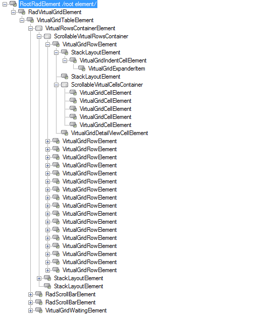

# Element Hierarchy

__RadVirtualGrid__ uses the [Telerik Presentation Framework]()  which enables rich experiences like advanced styling and animations. Just like WPF it uses elements ordered in a visual tree called element hierarchy. This article describes the element hierarchy used in __RadVirtualGrid__:

    

* __VirtualGridElement__ is the root element in grid hierarchy. It contains all other grid elements.

* __VirtualGridTableElement__ contains all visual rows shown in the grid. If the hierarchical grid is used each child view has it own table element. The element can be accessed via the __TableElement__ property and exposes useful row/cell properties.

* __VirtaulGridRowElement__ is the base visual element for presenting rows. It contains three different layouts enabling presenting frozen columns.

* __VirtualGridCellElement__ is the base visual element for presenting cells. It references __VirtaulGridRowElement__ objects.

* __Scrollbar Elements__ – instead of using the build-in WinForms mechanism for scrolling, __RadVirtualGrid__ uses elements and implements custom logic. Scrollbar elements are accessible using the __HScrollBar__ and __VScrollBar__ properties of __TableElement__. When using hierarchy, you can choose between a single scrollbar and dedicated scrollbar elements in every child view. To do this, set the __UseScrollbarsInHierarchy__ property to *true*.

