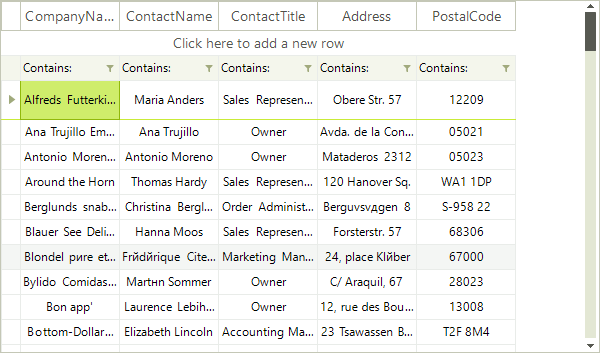

# Resizing Rows

__RadVirtualGrid__ exposes an API allowing resizing of its rows. In order to utilize it we need to set the __AllowRowResize__ property to *true*.

{{source=..\SamplesCS\VirtualGrid\Rows\VirtualGridResizingRows.cs region=AllowRowResize}} 
{{source=..\SamplesVB\VirtualGrid\Rows\VirtualGridResizingRows.vb region=AllowRowResize}}
````C#
this.radVirtualGrid1.AllowRowResize = true;

````
````VB.NET
Me.RadVirtualGrid1.AllowRowResize = True

```` 


{{endregion}}

## End User Functionality

The grid rows can be resized by end users simply by positioning the mouse over the horizontal grid line and dragging it to a desired size.


## Resizing System Rows

The __VirtualGridTableElement__ object exposes properties for directly accessing its system rows and setting a desired height.


{{source=..\SamplesCS\VirtualGrid\Rows\VirtualGridResizingRows.cs region=ResizingSystemRows}} 
{{source=..\SamplesVB\VirtualGrid\Rows\VirtualGridResizingRows.vb region=ResizingSystemRows}}
````C#
this.radVirtualGrid1.TableElement.HeaderRowHeight = 30;
this.radVirtualGrid1.TableElement.NewRowHeight = 40;
this.radVirtualGrid1.TableElement.FilterRowHeight = 50;

````
````VB.NET
Me.RadVirtualGrid1.TableElement.HeaderRowHeight = 30
Me.RadVirtualGrid1.TableElement.NewRowHeight = 40
Me.radVirtualGrid1.TableElement.FilterRowHeight = 50

```` 


{{endregion}}

## Resizing Data Rows

The data rows can also be programatically resized. __VirtualGridTableElement__ provides a property for setting a uniform height to all rows and also a method for defining the height of a single row.


{{source=..\SamplesCS\VirtualGrid\Rows\VirtualGridResizingRows.cs region=ResizingDataRows}} 
{{source=..\SamplesVB\VirtualGrid\Rows\VirtualGridResizingRows.vb region=ResizingDataRows}}
````C#
this.radVirtualGrid1.TableElement.RowHeight = 60;

````
````VB.NET
Me.radVirtualGrid1.TableElement.RowHeight = 60

```` 


{{endregion}}



{{source=..\SamplesCS\VirtualGrid\Rows\VirtualGridResizingRows.cs region=SetRowHeight}} 
{{source=..\SamplesVB\VirtualGrid\Rows\VirtualGridResizingRows.vb region=SetRowHeight}}
````C#
this.radVirtualGrid1.MasterViewInfo.SetRowHeight(0, 40);

````
````VB.NET
Me.RadVirtualGrid1.MasterViewInfo.SetRowHeight(0, 40)

```` 


{{endregion}}

## Events

The API exposes two events for notifications when a change in the height of a row is about to happen or has already happened.

* __RowHeightChanging__: Raised before the operation starts, it can be canceled. The event arguments:

 * __Cancel__: If set to *true* suspends the operation.

 * __NewHeight__: Value of the new row height.

 * __OldHeight__: Value of the old row height.

 * __RowIndex__: The index of the row which is about to be resized.
  
 * __ViewInfo__: Reference to the __VirtualGridViewInfo__ object.

* __RowHeightChanged__: Raised after the execution of the resizing operation. The event arguments:

 * __RowIndex__: The index of the resized row.
  
 * __ViewInfo__: Reference to the __VirtualGridViewInfo__ object.

{{source=..\SamplesCS\VirtualGrid\Rows\VirtualGridResizingRows.cs region=ResizingEvents}} 
{{source=..\SamplesVB\VirtualGrid\Rows\VirtualGridResizingRows.vb region=ResizingEvents}}
````C#
private void radVirtualGrid1_RowHeightChanging(object sender, VirtualGridRowHeightChangingEventArgs e)
{
    if (e.RowIndex == 1)
    {
        e.Cancel = true;
    }
}
private void radVirtualGrid1_RowHeightChanged(object sender, VirtualGridRowEventArgs e)
{
}

````
````VB.NET
Private Sub radVirtualGrid1_RowHeightChanging(sender As Object, e As VirtualGridRowHeightChangingEventArgs)
    If e.RowIndex = 1 Then
        e.Cancel = True
    End If
End Sub
Private Sub radVirtualGrid1_RowHeightChanged(sender As Object, e As VirtualGridRowEventArgs)
End Sub

```` 


{{endregion}}
